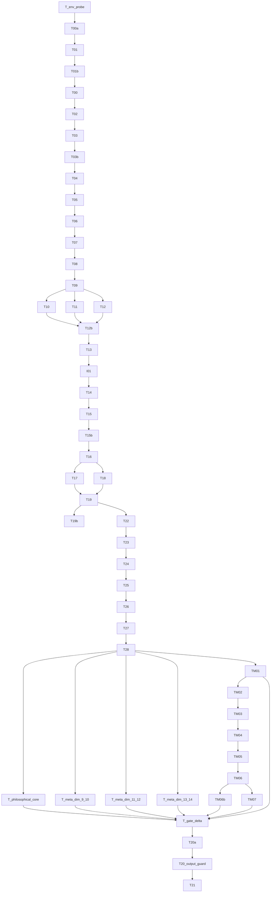

<!-- 作者：阿洋 -->

<div align="center">

# Profound Cognition | 深度穷尽研究

> *「别的 AI 给你一段摘要，这个给你一份每个结论都被自己人攻击过的深度报告——不赶时间，不省步骤，跑完就是能交付的成品。」*

[](SKILL.md)
[](SKILL.md)
[](https://skills.sh/llootupsl/profound-cognition)
[](LICENSE)

**[58 个原子节点](SKILL.md)跑成一条 DAG，三路对抗同时攻击你的结论，门控层层把关——跑完就是一份能直接交付的深度成品。**

[看效果](#它会交付什么) · [安装](#快速开始) · [触发方式](#触发方式) · [它和同类有什么不同](#它和同类有什么不同) · [安全边界](#安全边界)

</div>

---

## 你什么时候需要它？

事情是这样的。你问 AI 一个问题，它给你一段维基百科式的摘要。你觉得不够深，追问，它又给你一段差不多的东西。你要的不是"一段话"，是**穷尽**——把一个问题的每一层都翻到底，逻辑链每一环都有证据，每一个结论都被自己人攻击过。

三个真实场景：

- **你要交一份研究报告**：老板让你分析全球芯片产业链的地缘政治风险，不能只列几条新闻，要有数据、有反事实推演、有利益相关者图谱
- **你要写一篇有分量的公众号**：不是堆砌信息，是有人设、有叙事、有 Yang 7 维评分的成品
- **你要做一门课的讲义**：教学场景适配，从研究底座到科学层 8 模块都得覆盖

Profound Cognition 就是干这个的。它把一次深度分析建模为 58 个原子任务的 DAG 流水线：九层研究底座逐层递进，三路对抗验证同时攻击你的结论，[14 维全息框架](SKILL.md)确保没有盲区。最终产出不是"一段话"，而是一份**可追溯、可验证、可交付**的深度成品。

---

## 它会交付什么？

**输入**：`穷尽分析全球芯片产业链的地缘政治风险`

**执行过程摘要**：
```
▶ T_env_probe — 识别平台能力（strong档）
▶ T01 — 输入分流：识别为地缘政治+经济学跨域问题，激活3个领域引擎
▶ T02-T06 — 九层研究底座：从基础事实到反事实推演
▶ Gate-α — 研究底座门控：九层覆盖7/9，通过
▶ T09 — 7条推理路径并行，含因果发现与分支剪枝
▶ T10+T11+T12 — 三路对抗：逻辑攻击+证据攻击+范围攻击
▶ T13 — 认知综合：3轮递归，吸收对抗反馈
▶ T15 — 领域引擎：经济学+地缘政治+技术颠覆
▶ T22-T27 — 全息框架14维覆盖+跨维洞察+关系可视化
▶ TM01-TM07 + TM06b — 科学深度层（8模块）：系统动力学+因果验证+情景规划+Lean4 形式化验证+本体导出
▶ T17+T18 — 事实核查40条断言+偏见检测
▶ T20a — 渲染：≥100000字深度研究报告
✓ 交付前硬门控：G1-G6全部通过
```

**输出片段**（研究报告§2全维全域分析·地缘维度）：

> 美国对华芯片出口管制的效力窗口正在收窄。2023年10月更新规则后，NVIDIA通过A800/H800特供芯片维持了中国市场收入（2024Q1中国区营收占比仍达17%），但2024年12月新规将算力阈值从300 TOPS降至150 TOPS，堵截了"降规绕路"策略。然而，反事实推演表明：即使管制完全生效，中国成熟制程（28nm+）的自给率已从2022年的21%升至2024年的35%（SEMI数据），成熟制程占全球晶圆需求的72%——**管制打击的是尖端，但全球芯片消费的主力在成熟制程**。这一结构性错配使得管制的战略效果存在天花板。

### 三种成品类型

| 成品类型 | 交付物 | 核心特征 |
|---------|--------|---------|
| `research_report` | [≥10万字深度研究报告](examples/chip-geopolitics-research-report.md)（PDF/Word） | 14维全息框架+科学层8模块（含 Lean4 形式化验证）+哲学三元组 |
| `wechat_article` | [≥3000字公众号文章](examples/ai-job-impact-wechat-article.md) | 人设叙事+能力精选+Yang 7维评分 |
| `course_material` | ≥50000字讲义/视频脚本 | 教学场景适配，双模态输出 |

### DAG 拓扑可视化

完整的 58 节点 DAG 拓扑图见 [assets/dag-topology.mmd](assets/dag-topology.mmd)（Mermaid 格式，GitHub 原生渲染），执行时间线见 [assets/execution-timeline.md](assets/execution-timeline.md)。



---

## 快速开始

```bash
# 一行安装（推荐）
npx skills add llootupsl/profound-cognition
```

<details>
<summary>手动安装（无 npx 时）</summary>

```powershell
# Windows
git clone https://github.com/llootupsl/profound-cognition.git $env:USERPROFILE\.claude\skills\profound-cognition
```

```bash
# macOS / Linux
git clone https://github.com/llootupsl/profound-cognition.git ~/.claude/skills/profound-cognition
```

</details>

装完对 Agent 说：

```text
穷尽分析中国新能源汽车产业的竞争格局与供应链韧性
```

安装后重启 IDE，框架自动注册。

---

## 触发方式

- "深度研究一下XXX"
- "穷尽分析XXX"
- "全面调研XXX"
- "帮我写一份关于XXX的深度研究报告"
- "写一篇关于XXX的公众号文章"
- "制作一份关于XXX的课程讲义"
- "对抗验证一下这个结论：XXX"
- "事实核查：XXX的说法是真的吗？"

---

## 它和同类有什么不同？

| 维度 | 同类做法 | 本 Skill |
|------|----------|----------|
| 形态 | 独立应用或单文件Skill，需Python环境+API Key | Skill格式，git clone即用，零API Key |
| 深度 | 搜→写，无结构化维度 | 14维全息框架+9层研究底座，每层独立Sub-Agent |
| 验证 | 部分有critic/auditor或无 | 三路对抗（逻辑+证据+范围）同时攻击+Logistic胜负判定 |
| 质控 | 无门控或单道门控 | 5道Gate节点+G1-G6交付硬门控+4级质量体系 |
| 成品 | 仅报告 | 3种成品类型（报告/公众号/课程） |
| 模式 | 有快速/精简模式或固定流程 | EXHAUST穷尽模式，永远穷尽无档位无上限 |
| 领域覆盖 | 通用或单领域 | 35个领域引擎（含军事/外交/国力/历史等） |
| 数学基础 | 无或概念声明 | 4个非线性公式实际运作（Softmax/Logistic/指数衰减/Sigmoid） |
| 上下文管理 | 截断或丢弃 | write-while-research落盘释放，不丢弃任何分析维度 |

---

## 核心流水线

```
环境探测 → 时间锚定 → 输入分流 → 研究大纲
→ 九层研究底座 → Gate-α
→ 认知解构 → 多路径推理 → 三路对抗 → 认知综合 → Gate-β
→ 领域引擎 → Gate-γ
→ 全息综合 → 跨维洞察 → 关系可视化 → 极限决策 → Gate-终
→ 科学深度层（8模块，含 Lean4 形式化验证） → Gate-δ
→ 事实核查 + 偏见检测 → 交付守卫 → 输出渲染 → 输出卫士
```

### 九层研究底座

**L1** 基础事实 → **L2** 时间演化 → **L3** 结构变量 → **L4** 比较参照 → **L5** 感知叙事 → **L6** 证据边界 → **L7** 利益相关者 → **L8** 反事实推演 → **L9** 知识边界

### 三路对抗验证

- **逻辑对抗** — 检查推理链中的逻辑断裂、循环论证、偷换概念
- **证据对抗** — 攻击证据链的可靠性、完整性、时效性
- **范围对抗** — 挑战分析的边界条件、隐含假设、未覆盖维度

### 35个分析领域

文学 · 影视 · 历史 · 艺术 · 商业 · 心理 · 社会 · 哲学 · 科学 · 法律 · 教育 · 文化 · 健康 · 科技 · 宗教 · 体育 · 美食 · 政治 · 金融量化 · 媒体传播 · 工程学 · 认知科学 · 环境气候 · 城市规划 · 人类学 · 建筑学 · 数据科学 · 设计学 · 经济学 · 语言学 · 音乐 · 外交 · 军事 · 国力 · 数学

### 质量保障四层

| 层级 | 机制 | 职责 |
|------|------|------|
| L1 Sub-Agent 自检 | Do-Check-Retry | 任务产出自我验证，失败自动重试 |
| L2 Supervisor 检查 | 宪法条款 S01~S05 | 独立Sub-Agent执行任务级质量仲裁 |
| L3 Gate 门控 | Gate-α/β/γ/δ/终 | 阶段级覆盖度与收敛性评估 |
| L4 Orchestrator 裁决 | 三维度评分 | 内洽度/创新度/实用度，全绿→放行 |

---

## 安全边界

- **不会简化**：EXHAUST模式无快速/精简档位，每次执行都是全量穷尽
- **不会跳过节点**：58节点全量激活，执行账本对用户可见，缺一不可交付
- **不会泄露内部痕迹**：输出卫士在交付前扫描清除所有节点编号、Gate名、内部字段
- **不会伪造引用**：CoVe级联事实核查，断言分解→独立验证→交叉比对
- **不会擅自执行危险操作**：不删除文件、不提交git、不发送外部请求（除非用户明确要求联网检索）
- **中途可停**：用户随时中断，输出当前完成度摘要，支持断点续写

---

## 文件结构

```
profound-cognition/
├── SKILL.md                    ← DAG编排协议入口（单一真实源）
├── README.md                   ← 本文件
├── CHANGELOG.md                ← 版本演进历史
├── LICENSE                     ← MIT
├── test-prompts.json           ← 验收测试集（6 prompt + EXHAUST 审计清单）
├── evals/                      ← 评估集（3 prompt + 6 维度评分基准）
├── examples/                   ← 真实案例
├── tasks/                      ← 58个原子任务模板
├── extensions/                 ← 条件路由扩展（非DAG核心节点）
├── supervisors/                ← Supervisor检查清单+宪法协议
├── knowledge/                  ← 知识库（研究底座、认知框架、35领域引擎）
├── protocols/                  ← 执行/交接/穷尽重试/决策/渲染/扩写/落盘等协议
├── renderers/                  ← 风格文章渲染模块
├── rendering-pipeline/         ← 渲染管道（v5.0.0 审美进化核心）
├── output/                     ← 文档/幻灯片/插图/字体/美学渲染模块
├── scripts/                    ← 参考完整性+EXHAUST一致性+tasks健康检查脚本
├── assets/                     ← demo录制脚本+可视化产物+结果卡片
├── docs/                       ← 公式调用链路映射+升级完整性审计
└── .claude-plugin/             ← Plugin Marketplace配置
```

---

## 验证与测试

验收prompt：

```text
穷尽分析中国新能源汽车产业2025年的竞争格局与供应链韧性
```

合格表现：应触发research_report模式，58节点全量激活，产出≥100000字深度研究报告，含14维全息框架、科学层8模块（含 Lean4 形式化验证）、哲学三元组，交付前硬门控G1-G6全部通过。

### EXHAUST 一致性审计

| 检查项 | 合格表现 |
|--------|----------|
| 首次回复声明 | 包含 EXHAUST 模式四大铁律完整声明 |
| 禁用措辞 | 全程无"降级""DEGRADED""简化""缩减""跳过""硬终止""终止研究" |
| 硬上限 | 无 max_rounds / 轮数上限 / 最多N次 / 递归上限 |
| 上下文压力 | 触发 write-while-research 落盘而非终止研究 |
| 节点激活 | 58节点全量激活，无 SKIPPED 节点 |
| Gate FAIL | 持续重试而非降级，不存在"FAIL + DEGRADED"路径 |

### 反例测试（负触发示例）

以下输入**不应激活** profound-cognition Skill：

| 负触发示例 | 原因 |
|-----------|------|
| "快速摘要 XXX" | 快速摘要属于浅层信息检索，非深度研究 |
| "一句话回答 XXX" | 一句话回答与 EXHAUST 穷尽模式矛盾 |
| "简单问答 XXX" | 简单问答不涉及多维度分析 |
| "XXX 的定义是什么" | 单维度概念查询，无需 14 维全息框架 |
| "帮我写个 XXX 函数" | 编程任务，非研究/分析类 |

完整测试集见 [test-prompts.json](test-prompts.json)。

---

## 平台兼容性

| 平台 | 支持的能力 | 平台适配项 |
|------|------------|--------|
| Claude Code / Cursor / Trae / Windsurf | 完整功能 | 无 |
| Claude.ai 网页端 | 核心研究+分析+事实核查 | 高保真渲染适配为纯文本Markdown |
| 其他网页端 | 核心研究+分析 | 渲染适配，联网检索需平台支持 |
| 无联网环境 | 核心研究+分析 | 事实核查适配为纯内部知识验证 |

运行环境探测节点（T_env_probe）在流水线启动时自动识别平台能力档位，下游节点据此自适应执行。

---

## 致谢

- 九层研究底座方法论受 [GPT Researcher](https://github.com/assafelovic/gpt-researcher) 的模块化架构启发
- 三路对抗验证受 [grill-me](https://skills.sh/mattpocock/skills/grill-me) 的"追问到骨头"理念启发
- EXHAUST穷尽模式与 [caveman](https://skills.sh/juliusbrussee/caveman/caveman) 的极简模式形成互补
- 量化评估思路受 [skill-creator](https://skills.sh/anthropics/skills/skill-creator) 的迭代测试框架启发

## License

[MIT](LICENSE)

---

<div align="center">

*别的 AI 给你一段摘要，这个给你一份每个结论都被自己人攻击过的深度报告。*

</div>
