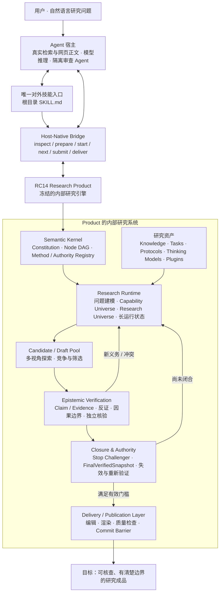
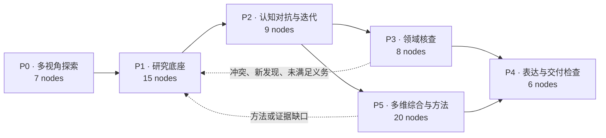
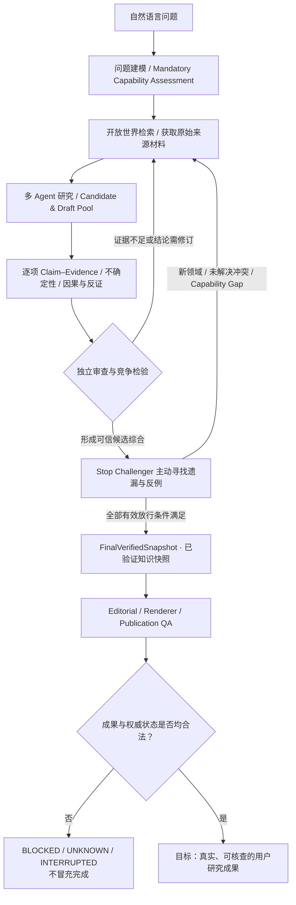
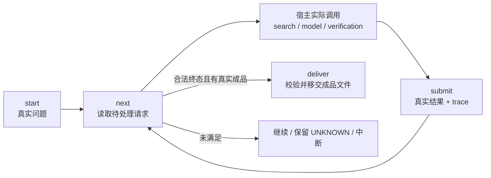

# Profound Cognition · 深度认知

> **我们希望把一个问题研究得尽可能深，而不是尽可能快地给出一个看起来完整的答案。**

有些问题，难的不是找到第一个解释，而是继续问下去：它的证据可靠吗？有没有另一种解释？有没有被忽略的反例？这个结论在什么条件下会失效？哪些问题仍然没有答案？

**Profound Cognition（深度认知）** 正是为这种持续追问而设计的。它是一套面向 Agent 平台的、正在开发与验证中的 **多 Agent 深度研究 Skills 系统**：尝试把自然语言问题转化为有计划、可扩展、会自我质询、能够留下证据轨迹的研究过程。

我们的目标不是让 AI 永远正确，也不是承诺“输入一句话就能自动出版”。我们希望尽最大可能，让研究 **更深、更有依据、更愿意接受反证，也更诚实地面对未知**。

> **项目现状：V9 RC14 · Host-Native 工程候选版，尚非正式产品 Release。** 目前已验证部分本地入口、文件完整性及受控运行路径；**尚未独立证明在真实 Agent 宿主上完成从外部检索、模型研究、独立审查直到最终用户成品的完整链路**。以下架构图主要说明实际文件中的**设计与实现组织**，不冒充真实世界的完整运行验收。

**阅读导航：** [为什么做](#为什么做) · [系统架构](#系统架构) · [研究如何运行](#研究如何运行) · [真实代码在哪里](#真实代码在哪里) · [安装与试用](#安装与试用) · [验证进度与限制](#验证进度与限制)

---

## 为什么做

一个回答可能写得流畅，却仍有重要漏洞：关键事实只用了单一来源；不同解释没有竞争；把相关写成了因果；无证据的猜测被写成了确定结论；为了赶快完成，研究在重要问题尚未解决时就停止。

深度认知尝试把这些问题转化为**研究工作流中必须正面处理的义务**，而不只是对模型说一句“请再深入分析”。

| 我们希望改变什么 | 系统尝试采用的机制 |
|---|---|
| 搜过几篇网页就下结论 | Research Universe 持续展开；新问题、新反证可以触发补查 |
| 多个 Agent 的回答直接拼接 | 所有重要新产出先进入 **Draft / Candidate Pool**，竞争、筛选、验证后才有资格提升 |
| 引用存在就被视为有证据 | 逐项检查 **Claim—Evidence—Uncertainty**、来源相关性、证据是否真正支持论断 |
| 忽略反例与因果条件 | 竞争解释、反证、冲突、边界条件和适用的因果/反事实方法 |
| 到了固定轮数就停止 | 用研究义务与 **Stop Challenger** 质询停止理由，而非让字数和成本决定真假 |
| 成品排版掩盖研究漏洞 | **FinalVerifiedSnapshot → Editorial / Renderer**；表达层不能自行增加事实或升级确定性 |

这些是项目的目标与控制规则。**文件、协议或测试存在，并不自动代表它们在真实 Agent 运行中已充分发挥作用。**

### 希望解决什么类型的问题？

- **复杂决策：** 一项战略依据哪些假设？什么证据能够推翻原有判断？
- **技术与科学：** 某种方案为何有效？什么情况下会失败？还有哪些竞争解释？
- **行业和公共议题：** 多个来源为何结论冲突？区别来自数据、方法还是利益立场？
- **知识综合：** 某个领域已经确定了什么？尚有什么争议、空白与值得进一步验证的方向？

例如，研究“某项新技术是否值得投入”，我们希望系统不仅罗列利弊，还主动追索关键证据、替代路线、因果假设、失败案例、适用边界，以及哪些新事实会改变投资判断。**这只是说明研究目标的示例，不是已经完成的实证运行案例。**

## 系统架构

深度认知不是“堆很多提示词”，也不是“越多 Agent 越可信”。它试图把 **Agent 宿主能力、运行适配器、研究内核、认知资产、验证权威与成果表达** 组织成分工明确的系统。

### 1. 整体系统分层


```mermaid
flowchart TB
    U["用户 · 自然语言研究问题"]
    H["Agent 宿主<br/>真实检索与网页正文 · 模型推理 · 隔离审查 Agent"]
    E["唯一对外技能入口<br/>根目录 SKILL.md"]
    B["Host-Native Bridge<br/>inspect / prepare / start / next / submit / deliver"]
    P["RC14 Research Product<br/>冻结的内部研究引擎"]

    subgraph ENGINE["Product 的内部研究系统"]
      K["Semantic Kernel<br/>Constitution · Node DAG · Method / Authority Registry"]
      R["Research Runtime<br/>问题建模 · Capability Universe · Research Universe · 长运行状态"]
      A["研究资产<br/>Knowledge · Tasks · Protocols · Thinking Models · Plugins"]
      D["Candidate / Draft Pool<br/>多视角探索 · 竞争与筛选"]
      V["Epistemic Verification<br/>Claim / Evidence · 反证 · 因果边界 · 独立核验"]
      F["Closure & Authority<br/>Stop Challenger · FinalVerifiedSnapshot · 失效与重新验证"]
      O["Delivery / Publication Layer<br/>编辑 · 渲染 · 质量检查 · Commit Barrier"]
      K --> R
      A --> R
      R --> D
      D --> V
      V -->|"新义务 / 冲突"| R
      V --> F
      F -->|"尚未闭合"| R
      F -->|"满足有效门槛"| O
    end

    U --> H
    H <--> E
    E --> B
    B <--> H
    B <--> P
    P --> K
    O --> Z["目标：可核查、有清楚边界的研究成品"]
```

**三条不能混淆的边界：**

1. **宿主不是 Product。** 搜索、模型、隔离审查必须由安装本 Skill 的 Agent 平台真实执行；外层脚本本身不拥有一套新的模型或搜索 API。
2. **内部 Product 不是另一个自动安装的 Skill。** 外层根目录 `SKILL.md` 是宿主入口；`FROZEN_HANDOFF.zip` 中包含内部完整 Product 和其自身的 `SKILL.md`，由 Python 运行路径处理，**不能假定平台会自动发现 ZIP 内的技能**。当前仓库另有 `PRODUCT_REFERENCE/SKILL.md` 作为只读参考；对递归扫描目录的宿主，需要额外确认不会误识别。
3. **验证不是包装。** Draft、证据、独立审查、知识冻结与渲染各有责任；程序跑完、调用成功或某个 Agent 声称“PASS”，不等于得到了可信研究结论。

### 2. 研究能力与完整 DAG

RC14 冻结 Product 的 `kernel/node_registry.yaml` 登记了 **65 个研究/控制节点、6 个 phase**，含跨阶段依赖。仓库中提供可浏览的 [节点注册表只读副本](PRODUCT_REFERENCE/kernel/node_registry.yaml)，也可以查看 [宪法规则](PRODUCT_REFERENCE/kernel/constitution.yaml)、[方法注册表](PRODUCT_REFERENCE/kernel/method_registry.yaml) 与 [权威注册表](PRODUCT_REFERENCE/kernel/authority_registry.yaml)。

| 注册阶段 | 节点数 | 主要职责（按节点定义概括） |
|---|---:|---|
| Phase 0 | 7 | 根视角与子视角生成、STORM 式探索、四层草稿、候选探索门控与收敛 |
| Phase 1 | 15 | 环境与输入、时间锚定、研究底座、结构与证据分析、反事实边界、初步研究门控 |
| Phase 2 | 9 | 认知解构、多路径推理、三路“魔鬼代言人”对抗、迭代补研与综合门控 |
| Phase 3 | 8 | 领域分析、跨域关系、级联事实核查、偏见与交付守卫 |
| Phase 4 | 6 | 研究报告、文章、课程材料等渲染入口，输出守卫、跨媒介检查与知识回收 |
| Phase 5 | 20 | NRSF 综合、全息维度、哲学与元维度、情景/因果/多 Agent 方法、最终质量门控 |

**请注意：** phase 编号是注册表中的分类，并不代表严格按 Phase 0→1→2→3→4→5 串行执行；实际依赖及可用性以完整 [Node Registry](PRODUCT_REFERENCE/kernel/node_registry.yaml) 和冻结 Runtime 为准。上表是阅读导航，**不是替代 65 节点原图的另一个权威 DAG**。


```mermaid
flowchart LR
    P0["P0 · 多视角探索<br/>7 nodes"] --> P1["P1 · 研究底座<br/>15 nodes"]
    P1 --> P2["P2 · 认知对抗与迭代<br/>9 nodes"]
    P2 --> P3["P3 · 领域核查<br/>8 nodes"]
    P2 --> P5["P5 · 多维综合与方法<br/>20 nodes"]
    P3 --> P4["P4 · 表达与交付检查<br/>6 nodes"]
    P5 --> P4
    P3 -.->|"冲突、新发现、未满足义务"| P1
    P5 -.->|"方法或证据缺口"| P1
```

这张图只用于快速理解**功能关系**；精确节点、全部依赖边和条件仍以机器可读的注册表为准。

### 3. V8 研究资产去哪了？

GitHub 默认分支最外层目前只有 **29 个普通文件**，并不代表 Research Product 只有 29 个文件。外层包含约 7 MB 的 `FROZEN_HANDOFF.zip`，其中再次封装完整的 RC14 Product ZIP；**内部 Product 有 1,183 个文件**，包含从 V8 演进而来的知识与研究资产，以及 V9 的 Runtime、Kernel、验证和出版相关代码。

| Product 内部目录 | 文件数 | 内容 |
|---|---:|---|
| `knowledge/` | 397 | 跨领域认知与研究参考资产 |
| `tasks/` | 65 | 研究任务与能力定义 |
| `protocols/` | 32 | 研究和执行契约 |
| `supervisors/` | 72 | 检查与审查相关资产 |
| `kernel/` | 33 | 宪法、节点、方法与权威注册表 |
| `runtime/` | 113 | 研究编排、状态、证据、验证与交付运行模块 |
| `rendering-pipeline/` | 33 | 输出形态和渲染相关资源 |

**文件被封装不等于功能被删除；文件存在也不等于能力已经被真实执行。** 这些文件数用于解释当前仓库的组织形态，而不是研究质量证明。为了保护冻结身份，我们目前没有在仓库根部直接改写或重排这套内部 Product。

## 研究如何运行

研究在逻辑上不是单向写作，而是可以因新证据、矛盾或未满足的研究义务而重新打开问题。


```mermaid
flowchart TD
    Q["自然语言问题"]
    Q --> U["问题建模 / Mandatory Capability Assessment"]
    U --> S["开放世界检索 / 获取原始来源材料"]
    S --> C["多 Agent 研究 / Candidate & Draft Pool"]
    C --> E["逐项 Claim–Evidence / 不确定性 / 因果与反证"]
    E --> V{"独立审查与竞争检验"}
    V -->|"证据不足或结论需修订"| S
    V -->|"形成可信候选综合"| X["Stop Challenger 主动寻找遗漏与反例"]
    X -->|"新领域 / 未解决冲突 / Capability Gap"| S
    X -->|"全部有效放行条件满足"| F["FinalVerifiedSnapshot · 已验证知识快照"]
    F --> R["Editorial / Renderer / Publication QA"]
    R --> G{"成果与权威状态是否均合法？"}
    G -->|"否"| H["BLOCKED / UNKNOWN / INTERRUPTED<br/>不冒充完成"]
    G -->|"是"| O["目标：真实、可核查的用户研究成果"]
```

这个设计强调：

- **Draft-first：** 任何 Agent 或模块的新认知默认都只是候选资产，不能直接写入最终知识。
- **证据支撑不是“附几个链接”：** 需要核实原始来源、具体论断、反证、证据质量和独立性。
- **相关不等于因果：** 有必要的识别条件与反事实依据才可以提升因果表述；否则保留条件与未知。
- **停止理由要经受挑战：** 关键研究义务没有解决，就不能因为生成内容足够长或系统花费足够多而自动宣告闭合。
- **出版层没有新事实权：** PDF、DOCX 或其他表达形式的生成能力，不意味着内容已经获得学术发表资格或经过外部同行评审。
- **真实性优先于“全绿”：** 缺少工具、证据或独立审查时，系统应该诚实中断或保留未解决状态。

## 真实代码在哪里

```text
profound-cognition/
├── SKILL.md                    # 宿主可读取的外层 Skill 入口
├── FROZEN_HANDOFF.zip          # 冻结容器：内部 Product ZIP + 桥接材料
├── PRODUCT_REFERENCE/          # 部分内部 Product 文件的可浏览只读镜像
│   ├── SKILL.md                # 内部 Product 的参考入口，不应视作自动注册的第二个 Skill
│   └── kernel/                 # constitution / node / method / authority
├── src/
│   ├── native_host_bridge.py   # 宿主工具请求与响应记录、运行调度接口
│   └── publication_handoff.py  # 已有成品文件的字节验证与移交
├── BRIDGE_REFERENCE/           # 独立 R01 工程桥接参考代码
├── tests/                      # 当前外层安装与受控运行检查
├── QA/                         # 工程测试的原始记录
├── STATUS.md                   # 当前工程候选的成熟度与阻断条件
└── MANIFEST.sha256             # 文件完整性清单
```

**这是一个外层 Agent Skill + 冻结 Research Product 的组织方式，不是两个依赖宿主自动安装的 Skill。** 内部 Product 自带 `SKILL.md` 与 renderer 资源，但它们需要由现有运行代码明确访问，不能把 ZIP 内的文件当成已由平台自动识别的独立技能。

代码、清单和部分内核材料可在本仓库浏览；完整 Product 源码位于嵌套归档内。当前仓库**不是可直接逐个浏览所有 1,183 个 Product 文件的完整展开镜像**。我们会把这种可见性限制明确告诉使用者，而不将其隐藏在复杂术语中。

## 安装与试用

**适用对象：** 有能力运行 Python、读取文件并调用宿主 Agent 原生工具的技术试用者。**不是“所有 Agent 平台通用、一键导入即运行完成”的承诺。**

### 1. 获取文件

从本仓库点击 **Code → Download ZIP**，或克隆当前默认分支：

```bash
git clone --single-branch https://github.com/llootupsl/profound-cognition.git
```

确保 `SKILL.md`、`FROZEN_HANDOFF.zip`、`src/` 位于同一个 `profound-cognition` 目录中。**不要只复制 `SKILL.md`，也不要假设 ZIP 内部会被 Agent 宿主自动解包并作为第二个技能安装。**

如果宿主会递归扫描所有子目录中的 `SKILL.md`，必须先确认它只注册正确的外层入口。当前工程候选尚未完成跨平台的自动发现与安装兼容性验收。

### 2. 需要哪些宿主能力

- Python 3 与允许读写独立运行目录的文件系统环境；
- 真实网页正文检索（不仅是网址或无正文摘要）；
- 可实际调用的主模型及**真正隔离**的审查 Agent；
- 能够持续执行 `next → 宿主真实调用 → submit` 的运行环境。

**默认不要求额外配置第三方模型或搜索 API Key**；系统希望复用宿主已有能力。但宿主不提供某种能力时，不能假装可用。

### 3. 运行入口（工程试用）

```bash
# 在 profound-cognition/ 目录中执行
python -B src/native_host_bridge.py inspect --handoff FROZEN_HANDOFF.zip

# 独立的全新空目录；不要与另一次研究复用
python -B src/native_host_bridge.py prepare \
  --handoff FROZEN_HANDOFF.zip --evidence ./research-run
```

准备完成后，让宿主 Agent 阅读 [`SKILL.md`](SKILL.md)，以真实自然语言问题、真实主模型和隔离审查主体参数执行 `start --scope user`。随后需持续处理：


```mermaid
flowchart LR
    A["start<br/>真实问题"] --> B["next<br/>读取待处理请求"]
    B --> C["宿主实际调用<br/>search / model / verification"]
    C --> D["submit<br/>真实结果 + trace"]
    D --> B
    B -->|"合法终态且有真实成品"| E["deliver<br/>校验并移交成品文件"]
    B -->|"未满足"| F["继续 / 保留 UNKNOWN / 中断"]
```

注意：`src/native_host_bridge.py` 是**调用协议和字节交接层**，不是自主搜索或调用模型的隐藏服务。没有实际宿主工具返回，不能拿模拟响应冒充研究进展。`deliver` 只能复核和移交已经存在的真实文件，**不代表外部出版、学术评审或独立认识论验收通过**。

### 下一步技术入口

- [Skill 运行要求](SKILL.md)
- [Native Host Bridge](src/native_host_bridge.py)
- [节点、方法和权威的来源](PRODUCT_REFERENCE/kernel/node_registry.yaml)
- [目前的验证状态](STATUS.md)
- [实现覆盖与尚待验证的能力](IMPLEMENTATION_COVERAGE_AND_RELEASE_GAPS.md)

## 验证进度与限制

我们愿意公开已经做到的事情，也愿意坦诚承认还没有做到的事情。

**已有的证据范围：** 本地 Skills 入口、冻结文件身份、受控运行测试与负例守卫；在本地受控环境中，真实 RC14 Product 可以由自然语言问题产生研究请求。这些事实**不等于**真实宿主已经完成完整深研究。

**尚未证明的关键能力：**

1. 任一真实目标 Agent 宿主中完整走通 **原文检索 → 模型研究 → 草稿准入 → 独立验证 → Stop Challenger → FinalVerifiedSnapshot → 用户成品**；
2. 主研究 Agent 与核验者的真正独立性，以及完整来源字节被正确消费；
3. 不同平台上的安装适配、长时恢复、任务闭合与可持续可靠性；
4. 输出质量相较普通模型显著提高，更不等于能够自动达到期刊发表、外部评审或正式出版标准。

本地工程记录还保留了一项未通过的正向闭合测试；不会因为其他测试通过就掩盖它。详细情况见 [STATUS.md](STATUS.md) 和 [工程覆盖与发布缺口](IMPLEMENTATION_COVERAGE_AND_RELEASE_GAPS.md)。

**当前仓库展示的 RC14 是工程候选，不是正式 Release。** 现有历史版本标签不应被理解为 RC14 已获验收。项目内部控制状态仍有待正式恢复，当前 README 的改善也不构成 Product 升级或阶段放行。

## 我们希望坚持什么

我们相信，深度研究的价值不只在于给出更多文字，而在于：**能交代结论的来处，愿意面对可能推翻它的证据，知道何时还不该下结论。**

这里有认真的雄心，也有真实的工程困难。我们希望一步一步证明，这种研究方式最终可以为复杂问题带来更值得信赖的理解。

如果你愿意参与技术试用、提供反例、指出未经证实的判断或改进研究工作流，欢迎使用 GitHub Issues 交流。**比赞美更有价值的，是具体、可复核的改进意见。**

---

*Profound Cognition / 深度认知 · V9 RC14 Host-Native Engineering Candidate · 阿洋*
