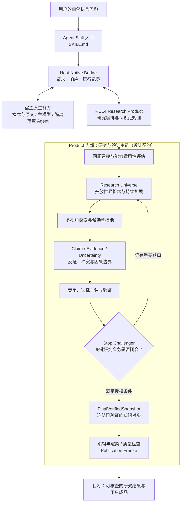
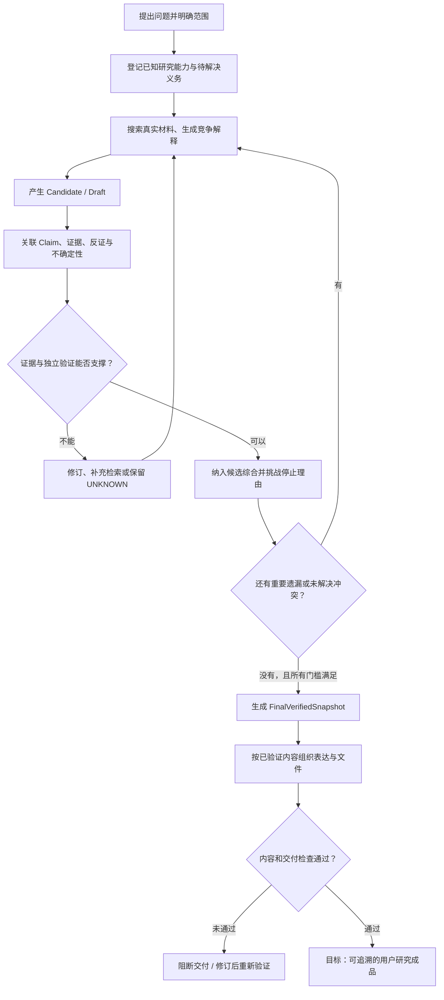
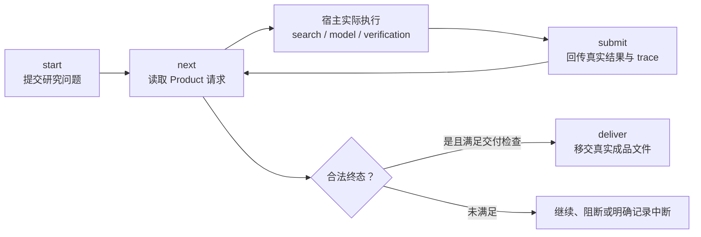

# Profound Cognition｜深度认知

> **把一个问题研究得尽可能深，而不是急着给出一个看似完整的答案。**

有些问题，真正困难的部分不是找到第一个答案，而是继续追问：证据从哪里来？还有哪些解释？反例是否成立？结论在哪些条件下会失效？我们究竟知道多少，还有多少不知道？

**Profound Cognition（深度认知）** 是一个正在建设与验证中的开源 **Agent Skill / 多 Agent 深度研究工作流**。我们希望它能借助宿主 AI 的检索、推理和审查能力，把一次自然语言提问变成一个持续展开、不断质疑、逐步收敛的研究过程。

我们追求的是 **尽最大可能把重要问题研究得足够深入、足够扎实、足够可追溯**。这不是“保证获得最终真相”，更不是“输入一句话就能自动产出可发表论文”的承诺。

**当前版本：V9 RC14 · Host-Native 工程候选版。** 已有可检查的源码入口和受控测试，但**尚未在真实 Agent 宿主上独立证明从检索到研究完成、独立审查和最终成品交付的全链路**。请把它视为一个认真推进中的项目，而非已经成熟的研究服务。

[为什么做](#为什么做) · [核心架构](#核心架构) · [研究如何推进](#研究如何推进) · [如何开始](#如何开始) · [当前进度](#当前进度与诚实的边界)

---

## 为什么做

一次 AI 回答可能语言流畅、逻辑顺畅，却仍然留下重要空白：没有搜索到关键反证，没有分清事实与推测，把相关关系写成因果解释，或在证据仍不足时过早下结论。

深度认知尝试从工作流层面解决这些问题，而不只是提示模型“再深入一点”。

- **不止找到信息，还要追问问题。** 先界定问题、展开相关领域与研究义务；新发现可能带来新问题，而不是被预先固定的提纲挡在门外。
- **不止支持结论，还要挑战结论。** 竞争解释、反证、冲突、未知和边界条件应进入研究过程，而不是被留给读者自行发现。
- **不把所有 Agent 的文字都当成事实。** 新产出先进入草稿池（Draft Pool），需要经过选择、证据检查和验证才能获得更高的认知权威。
- **不以字数、轮数或成本冒充深度。** 是否足够深入，应看重要研究义务有没有得到可信处理；不能解决的部分应明确保留。
- **不拿漂亮的成品掩盖薄弱的事实。** 报告的表达应受已验证材料约束，不能因为排版或叙事需要而编造新结论。

这些是本项目的**设计原则与工程约束**；它们不等于每项机制已经通过真实世界的独立验收。

## 它适合什么问题

我们希望它逐步成为复杂研究与判断的基础设施，特别适用于需要大量证据、多个视角和明确不确定性的工作，例如：

- **复杂决策：** 某项战略究竟依赖哪些关键假设？哪些证据会改变决策？
- **技术与科学问题：** 一种技术路线为什么成立，有哪些替代解释、约束和失败条件？
- **产业与公共议题：** 不同数据和立场为何得出不同结论？哪些差异来自研究方法而不是事实？
- **文献与知识综合：** 现有研究已经解决了什么，争议在哪里，下一步最值得验证什么？

举个**研究设计示意（不是运行结果）**：面对“某项新技术是否值得大规模投入”，理想的研究不会止于列举优势和风险，而会继续追查证据可靠性、替代方案、成本结构、反例、因果假设、适用边界，以及在什么条件下判断需要反转。

我们希望最终呈现的不只是一个结论，还包括**结论为什么成立、为什么可能不成立、以及还缺什么证据**。

## 核心架构

深度认知把“研究能力”和“宿主执行能力”分开：宿主提供真实的检索、模型和隔离审查工具；RC14 Research Product 管理研究义务、候选、证据、验证与最终状态；Host-Native Bridge 负责两者之间的请求和真实返回记录。

下面是根据当前 Skill 入口、Product 规范和代码组织整理的**逻辑架构图**。它描述系统的设计与实现边界，**不是对完整真实运行链路已成功的证明**。


```mermaid
flowchart TD
    Q["用户的自然语言问题"] --> ENTRY["Agent Skill 入口<br/>SKILL.md"]
    ENTRY --> BRIDGE["Host-Native Bridge<br/>请求、响应、运行记录"]
    BRIDGE <--> HOST["宿主原生能力<br/>搜索与原文 / 主模型 / 隔离审查 Agent"]
    BRIDGE <--> PRODUCT["RC14 Research Product<br/>研究编排与认识论规则"]

    subgraph RESEARCH["Product 内部：研究与验证主链（设计契约）"]
        A["问题建模与能力适用性评估"] --> B["Research Universe<br/>开放世界检索与持续扩展"]
        B --> C["多视角探索与候选草稿池"]
        C --> D["Claim / Evidence / Uncertainty<br/>反证、冲突与因果边界"]
        D --> E["竞争、选择与独立验证"]
        E --> F{"Stop Challenger<br/>关键研究义务是否闭合？"}
        F -->|"仍有重要缺口"| B
        F -->|"满足授权条件"| G["FinalVerifiedSnapshot<br/>冻结已验证的知识对象"]
        G --> H["编辑与渲染 / 质量检查<br/>Publication Freeze"]
    end

    PRODUCT -.-> A
    H --> OUT["目标：可核查的研究结果与用户成品"]
```

### 三层结构，各自负责什么

| 层次 | 责任 | 对应文件 |
|---|---|---|
| **Agent 宿主** | 提供真实的网络检索、原始材料、模型推理和独立审查环境；缺失时不能假装拥有 | 由安装它的宿主平台提供 |
| **Host-Native 适配层** | 将 Product 的请求交给宿主，保留真实输入、输出和调用记录，处理运行与交付边界 | [`SKILL.md`](SKILL.md)、[`src/native_host_bridge.py`](src/native_host_bridge.py) |
| **RC14 Research Product** | 管理能力全集、研究展开、草稿、Claim–Evidence、验证、停止挑战与知识冻结等研究规则 | [`FROZEN_HANDOFF.zip`](FROZEN_HANDOFF.zip) 中的完整 Product；[`PRODUCT_REFERENCE/`](PRODUCT_REFERENCE/) 为部分只读参考 |

核心研究引擎仍主要封装于 `FROZEN_HANDOFF.zip`，因此仓库顶层展示的源码**不是完整研究引擎的全部展开目录**。切勿仅凭页面可见的少数 Python 文件判断整个系统的复杂度或执行成熟度。

## 研究如何推进

这个项目的核心不是“让很多 Agent 同时写答案”，而是**让重要结论经历可质询的完整生命周期**。


```mermaid
flowchart TD
    A["提出问题并明确范围"] --> B["登记已知研究能力与待解决义务"]
    B --> C["搜索真实材料、生成竞争解释"]
    C --> D["产生 Candidate / Draft"]
    D --> E["关联 Claim、证据、反证与不确定性"]
    E --> F{"证据与独立验证能否支撑？"}
    F -->|"不能"| G["修订、补充检索或保留 UNKNOWN"]
    G --> C
    F -->|"可以"| H["纳入候选综合并挑战停止理由"]
    H --> I{"还有重要遗漏或未解决冲突？"}
    I -->|"有"| C
    I -->|"没有，且所有门槛满足"| J["生成 FinalVerifiedSnapshot"]
    J --> K["按已验证内容组织表达与文件"]
    K --> L{"内容和交付检查通过？"}
    L -->|"未通过"| M["阻断交付 / 修订后重新验证"]
    L -->|"通过"| N["目标：可追溯的用户研究成品"]
```

其中有几个容易被误解、却十分关键的区分：

**草稿不等于事实。** Agent 生成的是候选研究资产，不能因为表达自信就直接进入最终答案。

**引用不等于证据支持。** 研究不仅需要来源，还需要检查来源是否真正支持特定论断；相关性、因果性与预测应被分别对待。

**多个 Agent 不天然等于独立验证。** 真正的独立性取决于上下文、材料来源、执行环境以及谁有权确认结论。

**研究停止不是字数够了。** Stop Challenger 需要主动寻找遗漏、反证和隐藏冲突。如果有重要问题未解决，正确结果可能是继续研究、明确中断，或者诚实地说明无法完成。

**写得好看不等于研究成立。** 文档编辑与渲染不能凭空补充事实。最终成品的可信度，必须来自更早的研究和验证。

> 我们更愿意得到一个边界明确、仍有未知的结论，也不愿得到一份每句话都显得确定、但无法经受追问的报告。

## 如何开始

**当前定位：面向愿意参与技术试用与验证的 Agent 使用者。** 不是“一键安装即保证完成研究”的成熟产品。

### 1. 获取源码

在 [GitHub 仓库](https://github.com/llootupsl/profound-cognition) 点击 **Code → Download ZIP**，或使用 Git 克隆当前默认分支：

```bash
git clone --branch staging/v9-rc14-host-native --single-branch https://github.com/llootupsl/profound-cognition.git
```

把完整文件夹作为一个独立 Skill 放入兼容 Agent 宿主的 Skills 目录，并将文件夹命名为 `profound-cognition`。**不要只复制 `SKILL.md`**：它需要与 `FROZEN_HANDOFF.zip`、`src/` 等文件配套使用。

基础环境要求：**Python 3、可写的独立运行目录**；宿主还需要提供真实网页正文检索、可执行的模型以及能够隔离上下文的审查 Agent。通常**不要求另行配置第三方模型或搜索 API Key**，但这不意味着任何宿主都已经支持这些能力。

### 2. 验证入口与准备运行目录

在 Skill 根目录执行：

```bash
python -B src/native_host_bridge.py inspect --handoff FROZEN_HANDOFF.zip
python -B src/native_host_bridge.py prepare --handoff FROZEN_HANDOFF.zip --evidence ./research-run
```

`research-run` 必须是全新的空目录；它保存研究过程的运行记录，不应混入源码或重复用于另一问题。

### 3. 从自然语言问题启动

由实际宿主 Agent 按 [`SKILL.md`](SKILL.md) 的规范，填写真实的模型与独立审查主体身份，并使用 `--scope user` 启动。后续执行是：


```mermaid
flowchart LR
    A["start<br/>提交研究问题"] --> B["next<br/>读取 Product 请求"]
    B --> C["宿主实际执行<br/>search / model / verification"]
    C --> D["submit<br/>回传真实结果与 trace"]
    D --> B
    B --> E{"合法终态？"}
    E -->|"是且满足交付检查"| F["deliver<br/>移交真实成品文件"]
    E -->|"未满足"| G["继续、阻断或明确记录中断"]
```

这不是假设 Skill 自己拥有搜索接口：**`next` 与 `submit` 之间需要宿主实际调用工具**。没有真实搜索响应、模型推理或独立审查，不能用示例数据填补，也不能自称研究完成。

详细操作参数请阅读 [`SKILL.md`](SKILL.md)；工作流代码见 [`src/native_host_bridge.py`](src/native_host_bridge.py)。`deliver` 负责检查与移交已有文件，**不等于授予研究真实性或正式发布认证**。

## 当前进度与诚实的边界

**V9 RC14 仍是工程候选版，不是正式发布版本。**

目前有本地工程证据表明：Skill 入口元数据经过检查；冻结 Product 的身份校验、部分真实入口调用、搜索请求生成、受控传输与负面路径检查已有测试。相关技术记录见 [`STATUS.md`](STATUS.md) 和 [工程覆盖与缺口说明](IMPLEMENTATION_COVERAGE_AND_RELEASE_GAPS.md)。

但以下事情**还不能宣称已经证明**：

- 在真实目标 Agent 宿主中，从真实检索、模型研究到独立审查、停止挑战与用户成品完成的端到端链路；
- 不同 Agent 或模型主体的真实独立性，仅靠日志里的名称并不能证明；
- 所有重要研究义务都能在复杂现实问题上完成，或长时运行恢复已在真实环境中充分验证；
- 最终研究质量优于通用 AI，或者可以自动生成达到期刊或出版要求的作品。

一个历史受控测试还暴露了**无法完成正向研究闭合**的问题，相关负结果仍保留在工程记录中。我们不会为了获得“全绿”而降低证据标准。

**为什么仍公开这个候选版本？** 因为我们希望真正的问题可以被看到、复现、讨论和改善。项目值得追求的不是一份永远报喜的测试报告，而是最终用户确实能获得更深、更真、更有用的研究结果。

## 仓库导览

| 路径 | 你会找到什么 |
|---|---|
| [`SKILL.md`](SKILL.md) | Agent 平台的使用入口与研究执行要求 |
| [`FROZEN_HANDOFF.zip`](FROZEN_HANDOFF.zip) | 完整封装的 RC14 Research Product 与运行桥接材料 |
| [`PRODUCT_REFERENCE/`](PRODUCT_REFERENCE/) | 可直接阅读的 Skill 参考、宪法、节点及方法注册表 |
| [`src/`](src/) | 宿主原生执行适配与结果移交代码 |
| [`tests/`](tests/) | 当前外层适配器的测试 |
| [`STATUS.md`](STATUS.md) | 候选状态、工程验证范围与发布阻断条件 |
| [`IMPLEMENTATION_COVERAGE_AND_RELEASE_GAPS.md`](IMPLEMENTATION_COVERAGE_AND_RELEASE_GAPS.md) | 更详细的实现覆盖、证据与未验证能力 |
| [`MANIFEST.sha256`](MANIFEST.sha256) | 文件完整性校验清单（详细哈希在这里，不占据产品介绍首页） |

## 项目态度

我们相信，好的研究不只是“知道得更多”，也是**更清楚自己为什么相信、可能在哪里错、还需要查什么**。

深度认知希望把这种耐心和自我质询，变成 AI 可以持续执行、可以检查、可以改进的研究过程。

这是一个有雄心、也有尚未解决问题的项目。欢迎围绕真实使用体验、来源质量、竞争解释、运行证据和系统设计提出反馈。我们不会把愿景包装成已经完成的能力。

---

*Profound Cognition / 深度认知 · V9 RC14 Host-Native Engineering Candidate · Maintained by 阿洋*
