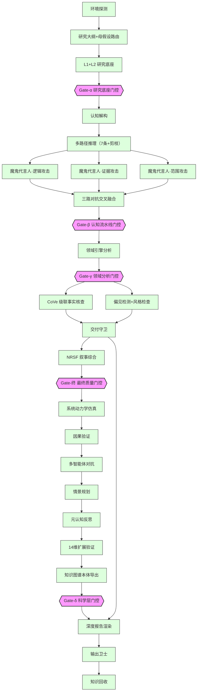

<!-- 作者：阿洋 -->

# DAG 拓扑图渲染（精简版）

> **示例渲染，非完整拓扑。** 本页展示 `assets/dag-topology.mmd`（57 节点完整 DAG）的精简版 Mermaid 渲染，仅保留关键节点与阶段流向，便于快速理解 profound-cognition 的执行架构。完整拓扑请参阅原文件。

---

## 精简版 DAG（关键节点与流向）



---

## 各阶段说明

### Phase 1 · 研究底座层（15 节点 · 完整版）

**做什么：** 建立研究的时间锚点、人设声音、母假设，搭建九层研究底座（L1-L9），完成纵横交叉矩阵分析。

**关键节点：**

| 节点 | 职责 |
|------|------|
| T_env_probe | 探测运行环境与模型能力，确认可用工具 |
| T00 | 研究大纲生成 + 母假设路由（决定后续分析方向） |
| T02 | L1+L2 研究底座（历史脉络 + 结构变量） |
| T07 | **Gate-α**：研究底座门控，检查底座完整性 |

**门控通过条件：** 九层底座齐全、母假设可证伪、纵横矩阵无遗漏。

---

### Phase 2 · 认知流水线层（9 节点 · 完整版）

**做什么：** 认知解构 → 多路径推理 → 三路对抗验证（魔鬼代言人）→ 认知综合 + 迭代深化。

**关键节点：**

| 节点 | 职责 |
|------|------|
| T08 | 认知解构：将课题拆解为可推理的子问题 |
| T09 | 多路径推理：7 条推理路径 + 分支剪枝 |
| T10 | **逻辑攻击**：攻击原结论的逻辑自洽性 |
| T11 | **证据攻击**：攻击原结论的证据充分性 |
| T12 | **范围攻击**：攻击原结论的适用范围 |
| T12b | 三路对抗交叉融合：综合三路攻击结果 |
| T14 | **Gate-β**：认知流水线门控 |

**核心机制：** 三路对抗并行执行（T10/T11/T12 同时启动），结果在 T12b 交叉融合，通过 Logistic 公式判定胜负比。

---

### Phase 3 · 领域分析与质量保障层（8 节点 · 完整版）

**做什么：** 领域引擎分析 → 跨域共振 → 事实核查 → 偏见检测 → 交付守卫。

**关键节点：**

| 节点 | 职责 |
|------|------|
| T15 | 领域引擎分析：激活相关领域引擎（如经济学、技术、地缘政治） |
| T16 | **Gate-γ**：领域分析门控 |
| T17 | CoVe 级联事实核查：对每条断言进行多轮验证 |
| T18 | 偏见检测 + 风格检查 |
| T19 | 交付守卫：综合质量裁决 |

**核心机制：** T17（事实核查）与 T18（偏见检测）并行执行，结果汇入 T19 交付守卫。

---

### Phase 7 · 元维度引擎 + 科学层（19 节点 · 完整版）

**做什么：** NRSF 叙事综合 → 14 维全息框架 → 哲学三元组审视 → 科学层 7 模块 → 最终门控。

**关键节点：**

| 节点 | 职责 |
|------|------|
| T22 | NRSF 叙事综合：整合全息框架三部分 |
| T23-T25 | 全息框架：问题认知（4维）→ 全维分析（8维）→ 极限决策（2维）= 14 维 |
| T26 | 跨维度洞察抽取（14 维交叉） |
| T28 | **Gate-终**：最终质量门控（8 项检查） |
| TM01-TM07 | 科学层 7 模块（见下表） |
| T_gate_delta | **Gate-δ**：科学层门控（7 项检查） |

**科学层 7 模块：**

| 模块 | 职责 |
|------|------|
| TM01 | 系统动力学仿真与反馈回路建模 |
| TM02 | 因果验证与反事实推断 |
| TM03 | 多智能体对抗性综合 |
| TM04 | 情景规划与不确定性景观 |
| TM05 | 元认知反思与认知边界 |
| TM06 | 14 维 + 元维度扩展验证 |
| TM07 | 知识图谱本体导出 |

---

### Phase 4 · 输出渲染与交付层（6 节点 · 完整版）

**做什么：** 根据报告类型渲染最终交付物 → 输出卫士审查 → 跨媒介审查 → 知识回收。

**关键节点：**

| 节点 | 职责 |
|------|------|
| T20a | 深度研究报告渲染（≥10 万字） |
| T20b | 公众号文章渲染（≥3000 字） |
| T20c | 课程材料渲染（≥50000 字） |
| T20_output_guard | 输出卫士：格式/字数/配图完整性检查 |
| T20d_cross_media_review | 跨媒介审查：多格式一致性 |
| T21 | 知识回收：沉淀到知识库 |

---

## 交付前硬门控（G1-G6）

```
G1 字数门控 → G2 结构门控 → G3 证据门控 → G4 配图门控 → G5 对抗门控 → G6 哲学门控
```

六道硬门控串联执行，任一失败则持续重试（EXHAUST 铁律：不降级、不跳过）。

---

## 与完整拓扑的差异

| 项 | 完整版（dag-topology.mmd） | 本精简版 |
|----|---------------------------|---------|
| 节点数 | 57 | ~25（关键节点） |
| 边数 | 完整依赖关系 | 主干流向 |
| Phase 1 | 15 节点 | 4 节点 |
| Phase 2 | 9 节点 | 8 节点 |
| Phase 3 | 8 节点 | 5 节点 |
| Phase 7 | 19 节点 | 12 节点 |
| Phase 4 | 6 节点 | 3 节点 |
| 元维度 | 4 组（9-14） | 未展示（归入 T28） |
| 哲学三元组 | 独立节点 | 未展示（归入 T28） |

> 完整拓扑请参阅 `assets/dag-topology.mmd`。

---

> **版本**：v5.1.0
> **说明**：本图为精简版 Mermaid 渲染，仅展示关键节点与阶段流向。完整 57 节点 DAG 见 `assets/dag-topology.mmd`。
