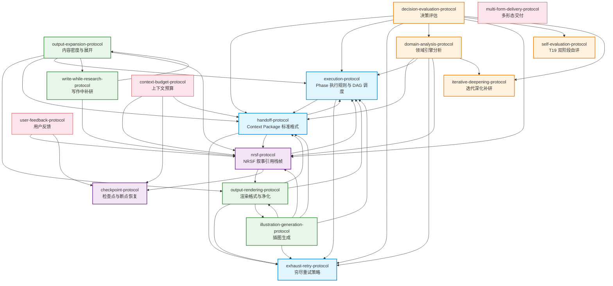

<!-- 作者：阿洋 -->

# 协议依赖图（Protocol Dependency Graph）

> **用途**：可视化展示 `protocols/` 目录下全部协议文件之间的依赖关系，用于循环依赖检测、孤立协议识别、职责边界审查。本图由 `scripts/protocol-deps-check.py` 自动校验，CI 强制执行（D1.4.2/D3.4.1）。
>
> **维护规则**：新增或修改协议依赖关系时，须同步更新本图与 `scripts/protocol-deps-check.py` 的解析逻辑。

---

## 1. 协议清单

`protocols/` 目录下共 16 个协议文件：

| # | 协议文件 | 职责 |
|---|---------|------|
| 1 | `execution-protocol.md` | Phase 0-3.5 执行规则与 DAG 调度 |
| 2 | `handoff-protocol.md` | Context Package 标准格式与节点间传递 |
| 3 | `nrsf-protocol.md` | NRSF 叙事引用栈帧——研究状态存储与叙事引用 |
| 4 | `checkpoint-protocol.md` | 检查点保存与断点恢复 |
| 5 | `exhaust-retry-protocol.md` | 节点失败穷尽重试策略 |
| 6 | `output-rendering-protocol.md` | 输出渲染格式转换与内部标记净化 |
| 7 | `output-expansion-protocol.md` | 输出内容密度与长度展开 |
| 8 | `write-while-research-protocol.md` | T20 写作中补研协议 |
| 9 | `self-evaluation-protocol.md` | T19 双阶段自评协议 |
| 10 | `decision-evaluation-protocol.md` | 决策评估方法论 |
| 11 | `domain-analysis-protocol.md` | 领域引擎分析协议 |
| 12 | `iterative-deepening-protocol.md` | I01 迭代深化补研协议 |
| 13 | `illustration-generation-protocol.md` | 插图生成协议 |
| 14 | `context-budget-protocol.md` | 上下文预算管理协议 |
| 15 | `user-feedback-protocol.md` | 用户反馈处理协议 |
| 16 | `multi-form-delivery-protocol.md` | 多形态交付协议 |

---

## 2. 依赖关系矩阵

> 箭头方向：A → B 表示 A 依赖 B（A 引用了 B）

| 依赖方（A） | 被依赖方（B） | 引用位置 |
|------------|-------------|---------|
| execution-protocol | handoff-protocol | 交叉引用 |
| execution-protocol | exhaust-retry-protocol | 交叉引用 |
| handoff-protocol | execution-protocol | 交叉引用 |
| handoff-protocol | exhaust-retry-protocol | 交叉引用 |
| handoff-protocol | nrsf-protocol | 交叉引用 |
| nrsf-protocol | execution-protocol | knowledge_refs |
| nrsf-protocol | output-rendering-protocol | knowledge_refs |
| nrsf-protocol | checkpoint-protocol | knowledge_refs |
| output-rendering-protocol | handoff-protocol | 交叉引用 |
| output-rendering-protocol | execution-protocol | 交叉引用 |
| output-rendering-protocol | exhaust-retry-protocol | 交叉引用 |
| output-rendering-protocol | illustration-generation-protocol | 交叉引用 |
| output-expansion-protocol | output-rendering-protocol | §1.1, §8.1 |
| output-expansion-protocol | handoff-protocol | §8.1 |
| output-expansion-protocol | execution-protocol | §8.2 |
| output-expansion-protocol | write-while-research-protocol | §9.1 |
| output-expansion-protocol | nrsf-protocol | §8.4 |
| write-while-research-protocol | nrsf-protocol | 补研结果追加到 NRSF |
| write-while-research-protocol | output-expansion-protocol | 展开密度规则联动 |
| decision-evaluation-protocol | handoff-protocol | §1 |
| decision-evaluation-protocol | execution-protocol | 交叉引用 |
| decision-evaluation-protocol | exhaust-retry-protocol | 交叉引用 |
| decision-evaluation-protocol | domain-analysis-protocol | 交叉引用 |
| decision-evaluation-protocol | nrsf-protocol | 交叉引用 |
| decision-evaluation-protocol | self-evaluation-protocol | 交叉引用 |
| decision-evaluation-protocol | iterative-deepening-protocol | 交叉引用 |
| domain-analysis-protocol | handoff-protocol | §2 |
| domain-analysis-protocol | execution-protocol | 交叉引用 |
| domain-analysis-protocol | exhaust-retry-protocol | 交叉引用 |
| domain-analysis-protocol | nrsf-protocol | 交叉引用 |
| domain-analysis-protocol | iterative-deepening-protocol | 交叉引用 |
| illustration-generation-protocol | handoff-protocol | §1 |
| illustration-generation-protocol | execution-protocol | 交叉引用 |
| illustration-generation-protocol | exhaust-retry-protocol | 交叉引用 |
| illustration-generation-protocol | output-rendering-protocol | 交叉引用 |
| illustration-generation-protocol | nrsf-protocol | 交叉引用 |
| context-budget-protocol | nrsf-protocol | 交叉引用 |
| context-budget-protocol | checkpoint-protocol | 交叉引用 |
| context-budget-protocol | handoff-protocol | 交叉引用 |
| user-feedback-protocol | nrsf-protocol | 交叉引用 |
| user-feedback-protocol | checkpoint-protocol | 交叉引用 |

---

## 3. Mermaid 依赖图

---

## 4. 职责边界说明

### 4.1 nrsf-protocol 与 output-expansion-protocol 职责分工

| 维度 | nrsf-protocol | output-expansion-protocol |
|------|---------------|--------------------------|
| **核心职责** | 定义研究状态的存储格式与叙事引用机制 | 定义最终输出的内容密度与长度展开规则 |
| **关注层面** | 研究过程层——节点产出如何存储、引用、聚合 | 输出成品层——最终报告如何展开到足够深度 |
| **数据结构** | NRSF-Full / NRSF-Summary / §ref 标记 | 字数地板 / 展开密度 / 信息密度公式 |
| **生命周期** | 对话期间存活，结束后清除 | T20 渲染阶段生效，影响最终成品 |
| **交互点** | T20 渲染时从 NRSF 读取叙事片段 | T20 渲染时按展开密度规则组织内容 |
| **不重叠** | 不定义输出长度或展开规则 | 不定义研究状态存储格式 |

**协作关系**：output-expansion-protocol 在 T20 渲染阶段从 NRSF（由 nrsf-protocol 定义）读取上游叙事片段，按本协议的展开密度规则组织为最终成品。两者在 T20 节点交汇，但职责正交。

### 4.2 output-rendering-protocol 与 output-expansion-protocol 职责分工

| 维度 | output-rendering-protocol | output-expansion-protocol |
|------|--------------------------|--------------------------|
| **核心职责** | 格式转换与内部标记净化 | 内容密度与长度展开 |
| **处理对象** | Markdown → HTML/DOCX/Typst 格式转换 | 内容深度、证据密度、章节展开 |
| **不重叠** | 不定义内容应多长、多深 | 不定义格式转换规则 |

---

## 5. 孤立协议说明

以下协议在当前版本中无被引用也无引用其他协议（`protocol-deps-check.py` 会标记为孤立）：

| 协议 | 状态 | 说明 |
|------|------|------|
| `multi-form-delivery-protocol.md` | 孤立 | 多形态交付协议，当前版本未与其他协议建立显式依赖。该协议独立定义交付形态转换规则，不直接引用其他协议。 |

> **处置规则**：孤立协议不阻塞 CI（退出码 0），但会在报告中标记为 WARNING，提示维护者确认是否需要建立依赖关系或是否为遗留协议。

---

## 6. 循环依赖说明

当前协议依赖图中存在双向引用（如 execution ↔ handoff），这属于**设计性双向引用**而非循环依赖：

| 双向引用对 | 说明 |
|-----------|------|
| execution ↔ handoff | 执行协议引用 handoff 的 context_package 格式；handoff 引用 execution 的 Phase 执行规则。二者是紧耦合的核心调度对，双向引用为设计意图 |
| output-expansion ↔ write-while-research | 展开协议引用补研协议的联动规则；补研协议引用展开协议的密度规则。二者在 T20 阶段协同工作 |

> **处置规则**：设计性双向引用在 `protocol-deps-check.py` 中通过白名单机制豁免，不视为循环依赖。非白名单的循环依赖将导致退出码 1。

---

© 阿洋
