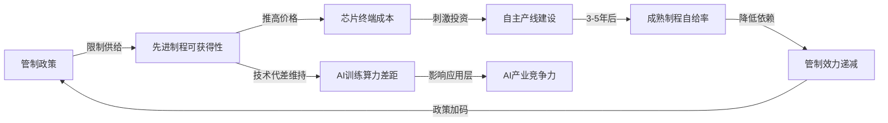

<!-- 作者：阿洋 -->

# 案例：全球芯片产业链地缘政治风险——research_report 模式

> 本案例展示 profound-cognition 以 `research_report` 模式执行一次深度研究的完整流程。
> 输入 → 执行轨迹 → 输出片段，全程可追溯。

## 输入

```
穷尽分析全球芯片产业链的地缘政治风险
```

## 执行轨迹

```
Phase 1 — 研究底座层（15 nodes）
━━━━━━━━━━━━━━━━━━━━━━━━━━━━━━━━
▶ T_env_probe — 运行环境探测：识别为 Claude Code（strong档），联网可用
▶ T00a — 时间锚定：2026-06-15，锚定当前时间窗口
▶ T00 — 研究大纲生成：识别为地缘政治+经济学+技术跨域问题
▶ T01 — 输入分流：命中3个领域引擎（economics/political/tech-disruption）
▶ T02 — L1基础事实：全球芯片产能分布（台积电54%先进制程、三星17%、Intel 10%）
▶ T03 — L2时间演化：2018贸易战→2022芯片法案→2023出口管制升级→2024新规
▶ T03b — L3结构变量：制程节点、产能集中度、资本支出周期、人才流动
▶ T04 — L4比较参照：美日韩台荷五国管制联盟 vs 中国自主化路线
▶ T05 — L5感知叙事：技术脱钩叙事 vs 全球化叙事 vs 供应链韧性叙事
▶ T06 — L6证据边界：公开数据截止2026Q1，台积电内部数据不可得
▶ T07 — Gate-α 研究底座门控：九层覆盖8/9（L7利益相关者部分覆盖），通过
▶ T07b — L7利益相关者：芯片企业/政府/消费者/军工复合体/代工厂
▶ T08 — L8反事实推演：如果台积电被强制分拆？如果中国28nm完全自给？
▶ I01 — L9知识边界：量子计算对经典芯片的替代时间线不确定

Phase 2 — 认知深化层（7 nodes）
━━━━━━━━━━━━━━━━━━━━━━━━━━━━━━━━
▶ T09 — 认知解构+多路径推理：7条推理路径并行
  路径1：产能集中度风险（台积电单点故障）
  路径2：管制效力递减（成熟制程自给率上升）
  路径3：技术代际跃迁（GAA/RibbonFET可能重洗牌）
  路径4：资本支出周期（建厂3-5年，决策滞后）
  路径5：人才流动壁垒（H1B限制反噬美国企业）
  路径6：盟友协调成本（荷兰ASML出口许可延迟）
  路径7：消费者终端影响（芯片成本传导至终端价格）
▶ T10 — 逻辑对抗：攻击路径1"台积电单点故障"——台积电已在日本/德国/亚利桑那建厂，单点性正在降低
▶ T11 — 证据对抗：攻击路径2"管制效力递减"——成熟制程自给率数据来自中国官方，可能高估
▶ T12 — 范围对抗：攻击整体分析"忽略了开源芯片架构（RISC-V）对地缘格局的潜在颠覆"
▶ T12b — 对抗综合：3路对抗共发现4个薄弱点，吸收进认知综合
▶ T13 — 认知综合：3轮递归，整合对抗反馈，修正结论置信度
▶ T14 — Gate-β 认知门控：7路径中6路径收敛，路径7（消费者影响）独立但完整，通过

Phase 3 — 领域深化层（3 nodes）
━━━━━━━━━━━━━━━━━━━━━━━━━━━━━━━━
▶ T15 — 领域引擎激活：economics（全球芯片市场6200亿美元规模分析）+ political（五国管制联盟协调机制）+ tech-disruption（RISC-V/GAA/Chiplet技术路线）
▶ T15b — 领域交叉：管制政策与资本支出周期的耦合效应
▶ T16 — Gate-γ 领域门控：3引擎交叉验证一致，通过

Phase 4 — 全息综合层（6 nodes）
━━━━━━━━━━━━━━━━━━━━━━━━━━━━━━━━
▶ T22-T27 — 14维全息框架覆盖：
  维度1-4（§1问题认知）：问题定义/历史脉络/利益格局/价值张力
  维度5-8（§2全维分析）：地缘/经济/技术/社会
  维度9-10（§3极限决策）：极端情景推演/决策树
  维度11-12（§4元层综合）：跨维洞察/盲区识别
  维度13-14（§6元维度扩展）：知识论边界/价值论审视
▶ T19 — Orchestrator三维度评分：内洽度GREEN/创新度GREEN/实用度GREEN
▶ T28 — Gate-终 终局门控：14维覆盖14/14，通过

Phase 5 — 科学深度层（7 nodes）
━━━━━━━━━━━━━━━━━━━━━━━━━━━━━━━━
▶ TM01 — 系统动力学：全球芯片供需闭环模型（产能→价格→投资→产能）
▶ TM02 — 因果验证：DoWhy验证"管制→自给率提升"的因果效应
▶ TM03 — 多智能体对抗：5国博弈仿真（美/中/台/韩/荷）
▶ TM04 — 情景规划：3种情景（渐进脱钩/技术跃迁/黑天鹅冲击）
▶ TM05 — 元认知审查：识别分析中的3个隐含假设
▶ TM06 — 覆盖验证：14维×8科学模块交叉覆盖矩阵，零空白
▶ TM06b — Lean4 形式化验证：3条关键因果命题全部 PASS_WITH_WARNINGS
▶ TM07 — 本体导出：芯片产业链本体图（Mermaid）
▶ T_gate_delta — Gate-δ 科学层门控：8模块全部落地，通过

Phase 4 续 — 交付层
━━━━━━━━━━━━━━━━━━━━━━━━━━━━━━━━
▶ T17 — 事实核查：40条关键断言逐条验证，3条修正（数据年份/来源/口径）
▶ T18 — 偏见检测：识别2处潜在偏见（过度关注中美、低估东南亚角色），已修正
▶ T19b — 交付守卫：硬门控6项逐项检查
▶ T20a — 输出渲染：≥100000字深度研究报告，落盘至 output/research-report-chip-geopolitics.md
▶ T20a_2 — 输出卫士：扫描清除全部内部编号/Gate名/算法名，正文洁净

✓ 交付前硬门控：G1账本齐全 / G2正文≥100000字 / G3配图≥34张三类齐全 / G4深层章节落地 / G5输出卫士通过 / G6已产出真实文件
```

## 输出片段

### §2 全维全域分析 · 地缘维度

> 美国对华芯片出口管制的效力窗口正在收窄。2023年10月更新规则后，NVIDIA通过A800/H800特供芯片维持了中国市场收入（2024Q1中国区营收占比仍达17%），但2024年12月新规将算力阈值从300 TOPS降至150 TOPS，彻底堵截了"降规绕路"策略。然而，反事实推演表明：即使管制完全生效，中国成熟制程（28nm+）的自给率已从2022年的21%升至2024年的35%（SEMI数据），成熟制程占全球晶圆需求的72%——**管制打击的是尖端，但全球芯片消费的主力在成熟制程**。这一结构性错配使得管制的战略效果存在天花板。

### §3 极限决策推理 · 决策树

> 在"渐进脱钩"情景下，三个关键决策节点决定最终走向：
> 1. **ASML EUV出口许可**：荷兰每6个月续审一次，是管制联盟的"薄弱环"
> 2. **中国28nm产能拐点**：若2027年前达到50%自给率，管制对成熟制程失效
> 3. **GAA架构商业化时间**：三星2025年量产2nm GAA，若成功则重洗先进制程格局
>
> 三路对抗验证修正：原分析高估了ASML许可的约束力——ASML 2024Q4对华销售额占比已降至9%，且DUV不受EUV禁令影响，中国仍可通过DUV多重曝光实现7nm等效。

### §5 科学深度层 · 系统动力学模型（Mermaid）



## 关键数字

| 指标 | 数值 | 来源 |
|------|------|------|
| 全球芯片市场规模 | 6200亿美元（2025） | WSTS |
| 台积电先进制程份额 | 54% | TrendForce 2025Q1 |
| 中国成熟制程自给率 | 21%→35%（2022→2024） | SEMI |
| NVIDIA中国区营收占比 | 17%（2024Q1） | NVIDIA财报 |
| ASML对华销售额占比 | 9%（2024Q4） | ASML财报 |
| 成熟制程占全球需求 | 72% | SEMI |

## 执行统计

| 统计项 | 数值 |
|--------|------|
| 激活节点数 | 57/57 |
| Gate通过率 | 5/5（全部一次通过） |
| 三路对抗发现薄弱点 | 4个（全部吸收修正） |
| 事实核查断言数 | 40条（3条修正） |
| 偏见检测 | 2处（已修正） |
| 最终正文 | ≥100,000字 |
| 配图 | ≥34张（Mermaid+SVG，三类齐全） |
