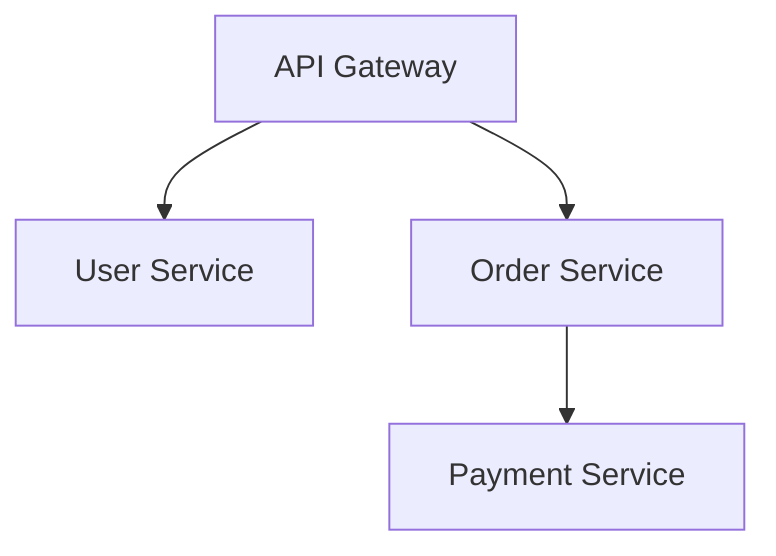

<!-- 作者：阿洋 -->


> **版本治理元数据 (D12.4.2)**:
> - version: 1.0
> - last_updated: 2026-06-25
> - maintainer: 阿洋
> - changelog:
>   - v1.0 初始版本（能力卡补全版本治理元数据，D12.4.2）

# AutoFigure

> **v2.0 废弃说明**: AutoFigure 原为开源图表生成工具，依赖 LLM 推理后端通过 Generator+Evaluator 循环迭代生成图表。该方式依赖 LLM 推理后端，违反"代码生成优先"原则，**已全面废弃**。所有原 AutoFigure 消费场景改为**代码生成**（Mermaid / 内联 SVG / Observable Plot），由 LLM 直接书写代码生成图表。详见 [illustration-generator.md §0 核心铁律](../../output/illustration-generator.md)。

## 基本信息
- **卡片编号**: #22
- **类型**: TC
- **优先级**: P1
- **层级**: L1
- **状态**: **deprecated**（已废弃）

## 废弃原因
1. AutoFigure 依赖 LLM 推理后端生成图表
2. 违反用户明确要求"大多数时候图片应该用代码生成，而非用API"
3. 违反 [illustration-generator.md §0 核心铁律](../../output/illustration-generator.md) 的代码生成优先原则

## 替代方案
所有原 AutoFigure 消费场景改为**代码生成**：

| 原 AutoFigure 场景 | 替代代码生成方式 |
|--------------------|-----------------|
| 自动从文本生成图表 | Mermaid / 内联 SVG / Observable Plot |
| 微服务架构图 | Mermaid flowchart / 内联 SVG |
| 数据关系图 | Mermaid graph / Observable Plot |
| 流程图 | Mermaid flowchart |

## 历史调用方式（已废弃，仅供历史参考）

### 原输入参数（已废弃）
- `description` (string, 图表的自然语言描述)
- `data` (object, 可选: 图表数据)
- `style` (string, 可选: 图表风格，如 minimal/colorful/academic)

### 原调用示例（已废弃）
```
# 已废弃——禁止调用
autofigure_generate(description="展示微服务架构中各服务的调用关系", data={"services":["API Gateway","User Service","Order Service","Payment Service"],"calls":[["API Gateway","User Service"],["API Gateway","Order Service"],["Order Service","Payment Service"]]}, style="minimal")
```

## 替代代码生成示例

### Mermaid 代码生成（替代 AutoFigure）


### 内联 SVG 代码生成（替代 AutoFigure）
```svg
<svg viewBox="0 0 400 300" xmlns="http://www.w3.org/2000/svg" role="img">
  <title>微服务架构调用关系图</title>
  <desc>展示API Gateway与User/Order/Payment Service的调用关系</desc>
  <!-- 由 LLM 直接书写 SVG 代码 -->
</svg>
```

## 依赖
- ~~AutoFigure 服务部署 + LLM 推理后端~~ **已废弃**
- 替代依赖：**无外部依赖**（纯代码生成，由 LLM 直接书写 Mermaid / SVG / Observable Plot 代码）

## 消费关系

### 消费此卡片的领域引擎

暂无显式领域引擎消费者。

### 消费此卡片的 DAG 节点

暂无显式 DAG 节点消费者。保留待扩展。

## 失败回退策略

- **触发条件**: 工具不可用、调用超时、输出质量不达标、依赖缺失
- **回退路径**: 降级到 LLM 内建能力，标注 [INTERNAL_REASONING]
- **回退声明**: 回退后失去工具增强能力，但保证流程不中断（EXHAUST 铁律）
- **穷尽重试**: 按 L1_FULL → L2_PARTIAL → L3_TEXT_ONLY → L4_SERVICE_DOWN 逐级降级

## 效果度量

| 度量指标 | 定义 | 目标值 |
|----------|------|--------|
| 执行成功率 | 成功调用次数 / 总调用次数 | ≥ 0.95 |
| 平均延迟 | 单次调用平均耗时 | ≤ 5s |
| 输出质量分 | Supervisor 评分（0-1） | ≥ 0.8 |
| 穷尽重试触发率 | 触发降级的调用次数 / 总调用次数 | ≤ 0.1 |

效果度量写入 NRSF，供 T19 质量检查消费。