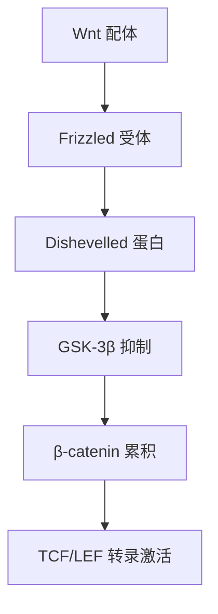

<!-- 作者：阿洋 -->


> **版本治理元数据 (D12.4.2)**:
> - version: 1.0
> - last_updated: 2026-06-25
> - maintainer: 阿洋
> - changelog:
>   - v1.0 初始版本（能力卡补全版本治理元数据，D12.4.2）

# PaperBanana

> **v2.0 废弃说明**: PaperBanana 原为专有 API 图表生成工具，使用 Nano Banana Pro (Gemini 3 Pro Image) 模型生成高质量学术图表。该方式违反"代码生成优先"原则，**已全面废弃**。所有原 PaperBanana 消费场景改为**代码生成**（内联 SVG / Mermaid / Canvas / Typst draw），由 LLM 直接书写代码生成顶刊级学术插图。详见 [illustration-generator.md §0 核心铁律](../../output/illustration-generator.md)。

## 基本信息
- **卡片编号**: #43
- **类型**: TC
- **优先级**: P2
- **层级**: L1
- **状态**: **deprecated**（已废弃）

## 废弃原因
1. PaperBanana 使用 Nano Banana Pro (Gemini 3 Pro Image) Google 专有 API 生成图表
2. 违反用户明确要求"大多数时候图片应该用代码生成，而非用API"
3. 违反 [illustration-generator.md §0 核心铁律](../../output/illustration-generator.md) 的 `forbidden_apis` 清单

## 替代方案
所有原 PaperBanana 消费场景改为**代码生成**：

| 原 PaperBanana 场景 | 替代代码生成方式 |
|---------------------|-----------------|
| 顶刊级学术插图（机制图/信号通路/架构图） | 内联 SVG（PaperBanana 方法论·代码生成版） |
| 数据图表 | Observable Plot / ECharts / Matplotlib |
| 流程图 | Mermaid |
| 手绘风格示意图 | excalidraw |

## 历史调用方式（已废弃，仅供历史参考）

### 原输入参数（已废弃）
- `description` (string, 图表描述)
- `style` (string, 可选: academic/infographic/minimal, 图表风格，默认 academic)
- `output_format` (string, 可选: png/svg, 输出格式，默认 png)

### 原调用示例（已废弃）
```
# 已废弃——禁止调用
paperbanana_generate.generate(description="中国GDP增长率折线图 2015-2025", style="academic", output_format="png")
```

## 替代代码生成示例

### 内联 SVG 代码生成（替代 PaperBanana）
```svg
<svg viewBox="0 0 400 300" xmlns="http://www.w3.org/2000/svg" role="img">
  <title>Wnt信号通路示意图</title>
  <desc>展示Wnt信号通路的关键蛋白相互作用机制</desc>
  <!-- 由 LLM 直接书写 SVG 代码生成顶刊级学术插图 -->
</svg>
```

### Mermaid 代码生成（替代 PaperBanana 流程图）


## 依赖
- ~~Google 专有 API（Nano Banana Pro / Gemini 3 Pro Image）~~ **已废弃**
- 替代依赖：**无外部依赖**（纯代码生成，由 LLM 直接书写 SVG/Mermaid/Canvas 代码）

## 消费关系

### 消费此卡片的领域引擎

暂无显式领域引擎消费者。

### 消费此卡片的 DAG 节点

暂无显式 DAG 节点消费者。保留待扩展。

## 方法论内化

> ★核心方法论已内化于 rendering-pipeline/ARCHITECTURE.md 和 rendering-pipeline/visual-dna.md，以下为快速参考

### 方法论原理（v2.0 代码生成版）
PaperBanana 方法论（v2.0 代码生成版）通过**代码生成**方式生成论文图表，解决了研究者图表制作耗时且设计质量不一致的问题，同时完全不依赖任何 AI 生图 API。

### 执行步骤（v2.0 代码生成版）
1. 解析论文数据段
2. 识别数据类型(时序/分类/关系)
3. 选择图表类型
4. **代码生成**：由 LLM 直接书写 SVG/Mermaid/Canvas 代码
5. 渲染输出

### 决策规则（v2.0 代码生成版）
| 条件 | 动作 |
|------|------|
| 需要顶刊级学术插图 | 内联 SVG（PaperBanana 方法论·代码生成） |
| 需要数据图表 | Observable Plot / ECharts / Matplotlib |
| 需要简单图 | Mermaid |

### 输出规范
```yaml
paperbanana_output:
  available: true  # 代码生成始终可用
  chart_format: "svg|mermaid|canvas"  # 代码生成格式
  chart_type: str
  degradation_note: "代码生成，无需外部 API"
```

### 穷尽重试策略（v2.0 代码生成版）
| 级别 | 方案 |
|------|------|
| L1 | 内联 SVG 代码生成（PaperBanana 方法论） |
| L2 | Mermaid 代码生成 |
| L3 | Canvas / Typst draw 代码生成 |
| L4 | 文字描述 |

## 效果度量

| 度量指标 | 定义 | 目标值 |
|----------|------|--------|
| 执行成功率 | 成功调用次数 / 总调用次数 | ≥ 0.95 |
| 平均延迟 | 单次调用平均耗时 | ≤ 5s |
| 输出质量分 | Supervisor 评分（0-1） | ≥ 0.8 |
| 穷尽重试触发率 | 触发降级的调用次数 / 总调用次数 | ≤ 0.1 |

效果度量写入 NRSF，供 T19 质量检查消费。