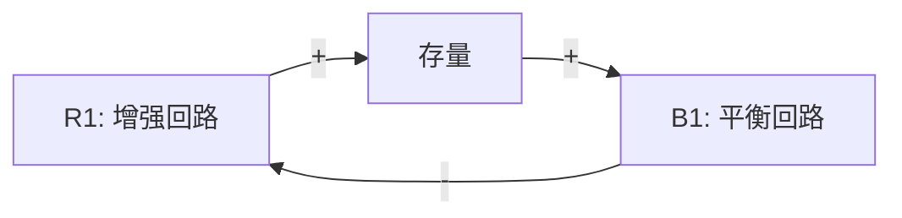
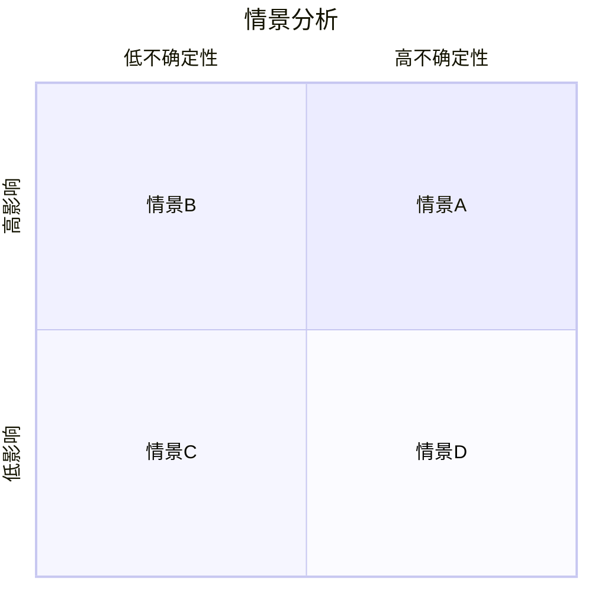
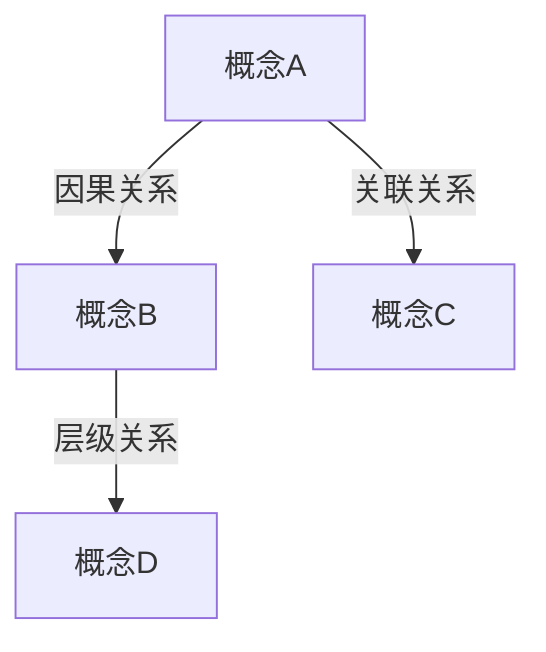
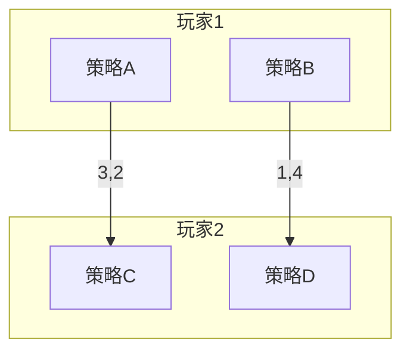

<!-- 作者：阿洋 -->

# Penrose DSL 模板代码骨架

> **版本治理元数据 (D12.4.2)**:
> - version: 1.1
> - last_updated: 2026-06-25
> - maintainer: 阿洋
> - changelog:
>   - v1.0 初始版本（CLD/系统基模/博弈矩阵等代码骨架）
>   - v1.1 补全版本治理元数据与交叉引用（D12.4.2-D12.4.3）

## 交叉引用

- **上游**: `knowledge/penrose-templates.md`（Penrose 全场景图解模板）
- **下游**: `tasks/TM01_system_dynamics.md`（系统动力学，CLD 模板）、`tasks/T22_nrsf_synthesize.md`（系统基模匹配）、`tasks/TM03_adversarial_synthesis.md`（博弈矩阵）
- **相关**: `knowledge/math-principles-72.md`（数学原理覆盖追踪）、`output/chart-renderer.md`（图表渲染器）、`output/illustration-generator.md`（插图生成器）

## 1. 因果回路图 (CLD)
```penrose
style {
  forall Variable v {
    v.shape = Circle {
      strokeWidth : 0.0
    }
    v.text = Text {
      string : v.label
    }
  }
  forall Edge e {
    e.shape = Arrow {
      strokeWidth : 1.5
      startArrowhead : false
      endArrowhead : true
    }
  }
}

const R1 = Variable("R1: 增强回路", (-3.0, 3.0))
const B1 = Variable("B1: 平衡回路", (3.0, 3.0))
const stock = Variable("存量", (0.0, 0.0))

R1 --+ stock
stock --+ B1
B1 -- stock
```

## 2. 情景象限图
```penrose
style {
  forall Quadrant q {
    q.shape = Rectangle {
      strokeWidth : 1.0
      strokeColor : Colors.Gray
    }
    q.text = Text {
      string : q.label
      fontSize : "12pt"
    }
  }
}

const axisX = Axis("不确定性轴: 低 → 高", (0.0, -5.0), (10.0, -5.0))
const axisY = Axis("影响轴: 低 → 高", (-5.0, 0.0), (-5.0, 10.0))

const Q1 = Quadrant("情景A: 低不确定-高影响", (0.0, 0.0))
const Q2 = Quadrant("情景B: 高不确定-高影响", (5.0, 0.0))
const Q3 = Quadrant("情景C: 低不确定-低影响", (0.0, -5.0))
const Q4 = Quadrant("情景D: 高不确定-低影响", (5.0, -5.0))
```

## 3. 概念网络图
```penrose
style {
  forall Concept c {
    c.shape = Circle {
      strokeWidth : 1.5
      strokeColor : c.color
    }
    c.text = Text {
      string : c.label
    }
  }
  forall Relation r {
    r.shape = Arrow {
      strokeWidth : 1.0
    }
    r.text = Text {
      string : r.label
      fontSize : "10pt"
    }
  }
}
```

## 4. 系统基模图 (System Archetype)
```penrose
style {
  forall Archetype a {
    a.shape = Rectangle {
      strokeWidth : 1.5
      strokeColor : Colors.Blue
    }
    a.text = Text {
      string : a.label
      fontSize : "11pt"
    }
  }
  forall FeedbackLoop f {
    f.shape = Arrow {
      strokeWidth : 1.5
      endArrowhead : true
    }
    f.text = Text {
      string : f.polarity
      fontSize : "10pt"
    }
  }
}

const growth = Archetype("增长上限", (-3.0, 3.0))
const limiting = Archetype("限制因素", (3.0, 3.0))
const action = Archetype("干预行动", (0.0, 0.0))

growth --+ limiting
limiting -- growth
action --+ growth
```

## 5. 博弈矩阵图 (Game Theory Matrix)
```penrose
style {
  forall Player p {
    p.shape = Rectangle {
      strokeWidth : 1.0
    }
    p.text = Text {
      string : p.label
    }
  }
  forall Strategy s {
    s.shape = Rectangle {
      strokeWidth : 0.5
      strokeColor : Colors.Gray
    }
    s.text = Text {
      string : s.label
      fontSize : "10pt"
    }
  }
  forall Payoff p {
    p.shape = Text {
      string : p.value
      fontSize : "12pt"
    }
  }
}
```

## 穷尽重试替代: Mermaid 等效
当 Penrose 不可用时，使用以下 Mermaid 模板：

### CLD Mermaid


### 情景象限 Mermaid


### 概念网络 Mermaid


### 系统基模图 Mermaid


### 博弈矩阵 Mermaid

