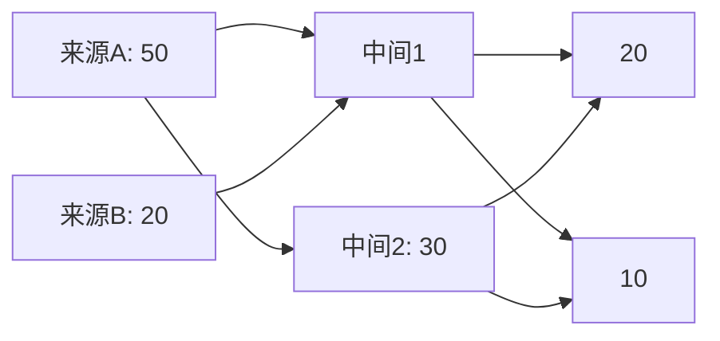

> **作者**: 阿洋

# Observable Plot + ECharts + Mermaid + Markmap + Plotly 图表生成规范

> **模块标识**: `output/chart-renderer`
> **职责**: 将研究数据转换为高质量可交互的数据图表。基于图表类型智能选择渲染引擎：Mermaid（结构图）→ Observable Plot（数据图）→ Markmap（概念图）→ ECharts（复杂图）→ Plotly（备选）
> **CLI 命令**: 无（JS 库，嵌入式或服务端生成）
> **依赖**: `output/aesthetic-enhancer`, `plugins/observable-plot-adapter`

---

## 一、四引擎选择逻辑

### 1.1 引擎选择决策树

```
输入: 图表需求
 ↓
判断图表类别：
 ├─ 结构性图表（流程图/关系图/因果回路图/架构图）
 │   → Mermaid（节点-边布局，原生支持）
 │
 ├─ 数据驱动图表（数据分布/趋势/对比/相关性/小多图）
 │   → Observable Plot（声明式 API，简洁快速）
 │
 ├─ 概念性图表（概念图/思维导图/知识图谱）
 │   → Markmap（层级展开折叠，原生支持）
 │
 └─ 复杂图表（桑基/热力/地图/3D/仪表盘/雷达图）
     → ECharts（全功能，可定制）
```

### 1.2 引擎选择规则

```yaml
engine_selection:
  rule_1_structural:
    types: ["流程图", "关系图", "因果回路图", "架构图", "时序图", "甘特图"]
    engine: "Mermaid"
    reason: "结构性图表需要节点-边布局，Mermaid 原生支持"
    detail: "见 output/chart-templates/mermaid-templates.md"

  rule_2_data_driven:
    types: ["数据分布", "趋势", "对比", "相关性", "小多图", "柱状图", "折线图", "散点图", "热力图"]
    engine: "Observable Plot"
    reason: "数据驱动图表需要精确的坐标映射和交互，Observable Plot 声明式 API 更简洁"
    detail: "见 plugins/observable-plot-adapter.md"

  rule_3_conceptual:
    types: ["概念图", "思维导图", "知识图谱"]
    engine: "Markmap"
    reason: "概念性图表需要层级展开和折叠交互，Markmap 原生支持"

  rule_4_complex:
    types: ["桑基图", "地图", "3D", "仪表盘", "雷达图", "漏斗图", "矩形树图"]
    engine: "ECharts"
    reason: "复杂图表需要全功能渲染引擎，ECharts 覆盖最广"
```

### 1.3 四引擎能力对比

| 维度 | Mermaid | Observable Plot | Markmap | ECharts |
|------|---------|----------------|---------|---------|
| 学习曲线 | 低 | 低 | 低 | 中 |
| 图表类型 | 结构图 | 10+ 数据图 | 思维导图 | 50+ 全类型 |
| 交互性 | 有限 | 自动 tooltip | 展开/折叠 | 全功能 |
| 动画 | 有限 | 无 | 过渡动画 | 丰富 |
| 文件大小 | ~200KB | ~100KB | ~50KB | ~1MB |
| 渲染方式 | SVG | SVG | SVG | Canvas/SVG |
| 适用场景 | 结构关系 | 数据分析 | 概念层级 | 复杂可视化 |

---

## 二、Observable Plot

### 2.1 基础使用

```html
<div id="plot-chart"></div>

<script type="module">
  import * as Plot from "https://cdn.jsdelivr.net/npm/@observablehq/plot@0.6/+esm";

  const data = [
    { quarter: "Q1", revenue: 1250 },
    { quarter: "Q2", revenue: 1480 },
    { quarter: "Q3", revenue: 1320 },
    { quarter: "Q4", revenue: 1680 },
  ];

  const chart = Plot.plot({
    title: "2025年度各季度营收",
    marks: [
      Plot.barY(data, { x: "quarter", y: "revenue", fill: "#2196F3" }),
      Plot.ruleY([0]),
    ],
    y: { label: "营收（万元）", grid: true },
    x: { label: "季度" },
    height: 400,
    width: 700,
  });

  document.getElementById("plot-chart").append(chart);
</script>
```

### 2.2 折线图

```javascript
Plot.plot({
  title: "趋势对比",
  marks: [
    Plot.line(data2024, { x: "quarter", y: "revenue", stroke: "#BDBDBD" }),
    Plot.line(data2025, { x: "quarter", y: "revenue", stroke: "#2196F3" }),
    Plot.dot(data2025, { x: "quarter", y: "revenue", fill: "#2196F3" }),
  ],
  color: { legend: true },
  y: { grid: true },
});
```

### 2.3 散点图

```javascript
Plot.plot({
  marks: [
    Plot.dot(data, {
      x: "x_value",
      y: "y_value",
      fill: "category",
      r: "size",
      tip: true,
    }),
    Plot.linearRegressionY(data, {
      x: "x_value",
      y: "y_value",
      stroke: "red",
    }),
  ],
});
```

### 2.4 面积图

```javascript
Plot.plot({
  marks: [
    Plot.areaY(data, {
      x: "date",
      y: "value",
      fill: "#2196F3",
      fillOpacity: 0.2,
    }),
    Plot.lineY(data, {
      x: "date",
      y: "value",
      stroke: "#2196F3",
    }),
  ],
});
```

### 2.5 分组柱状图

```javascript
Plot.plot({
  marks: [
    Plot.barY(data, {
      x: "quarter",
      y: "value",
      fill: "year",
    }),
    Plot.ruleY([0]),
  ],
  color: { range: ["#BBDEFB", "#2196F3", "#0D47A1"] },
});
```

### 2.6 饼图（通过 transform）

```javascript
Plot.plot({
  marks: [
    Plot.arcX(data, {
      x: "value",
      fill: "category",
      tip: true,
    }),
  ],
});
```

### 2.7 箱线图

```javascript
Plot.plot({
  marks: [
    Plot.boxY(data, {
      x: "group",
      y: "value",
      fill: "group",
      fillOpacity: 0.3,
    }),
  ],
  y: { grid: true },
});
```

---

## 三、Markmap

### 3.1 基础使用

```html
<script src="https://cdn.jsdelivr.net/npm/markmap-autoloader@0.16"></script>

<div class="markmap">
  <script type="text/template">
    ---
    markmap:
      colorFreezeLevel: 3
    ---
    # 研究主题
    ## 概念 A
    ### 子概念 A1
    ### 子概念 A2
    ## 概念 B
    ### 子概念 B1
    ### 子概念 B2
    ## 概念 C
  </script>
</div>
```

### 3.2 思维导图模板

```markdown
---
markmap:
  colorFreezeLevel: 3
  maxWidth: 300
---

# {{RESEARCH_TOPIC}}

## 核心概念
### 定义
### 特征
### 边界

## 关键变量
### 变量 A
### 变量 B
### 变量 C

## 因果关系
### 直接因果
### 间接因果
### 反馈回路

## 利益相关者
### 主体 A
### 主体 B
### 主体 C
```

### 3.3 色彩配置（与 aesthetic-enhancer.md 对齐）

```javascript
const markmapOptions = {
  color: (node) => {
    const colors = ['#2196F3', '#4CAF50', '#FF9800', '#9C27B0', '#F44336'];
    return colors[node.state.depth % colors.length];
  },
  duration: 500,
  maxWidth: 300,
  zoom: true,
  pan: true,
};
```

---

## 四、ECharts

### 4.1 基础使用

```html
<div id="echarts-chart" style="width: 800px; height: 500px;"></div>

<script src="https://cdn.jsdelivr.net/npm/echarts@6.0/dist/echarts.min.js"></script>
<script>
  const chart = echarts.init(document.getElementById('echarts-chart'));

  chart.setOption({
    title: { text: '2025年度各季度营收' },
    tooltip: {},
    xAxis: { data: ['Q1', 'Q2', 'Q3', 'Q4'] },
    yAxis: {},
    series: [{
      name: '营收',
      type: 'bar',
      data: [1250, 1480, 1320, 1680],
      itemStyle: { color: '#2196F3' }
    }]
  });
</script>
```

### 4.2 热力图

```javascript
chart.setOption({
  title: { text: '相关性热力图' },
  tooltip: {},
  xAxis: { data: ['A', 'B', 'C', 'D', 'E'] },
  yAxis: { data: ['A', 'B', 'C', 'D', 'E'] },
  visualMap: {
    min: -1, max: 1,
    inRange: { color: ['#1565C0', '#FFFFFF', '#C62828'] },
    calculable: true,
  },
  series: [{
    type: 'heatmap',
    data: heatmapData,
    label: { show: true },
  }],
});
```

### 4.3 桑基图

```javascript
chart.setOption({
  title: { text: '资金流向桑基图' },
  series: [{
    type: 'sankey',
    layout: 'none',
    data: [
      { name: '来源A' }, { name: '来源B' },
      { name: '中间1' }, { name: '中间2' },
      { name: '去向X' }, { name: '去向Y' },
    ],
    links: [
      { source: '来源A', target: '中间1', value: 50 },
      { source: '来源A', target: '中间2', value: 30 },
      { source: '来源B', target: '中间1', value: 20 },
      { source: '中间1', target: '去向X', value: 40 },
      { source: '中间1', target: '去向Y', value: 30 },
      { source: '中间2', target: '去向X', value: 20 },
      { source: '中间2', target: '去向Y', value: 10 },
    ],
    lineStyle: { color: 'gradient' },
  }],
});
```

### 4.4 雷达图

```javascript
chart.setOption({
  title: { text: '多维度评估' },
  radar: {
    indicator: [
      { name: '维度A', max: 100 },
      { name: '维度B', max: 100 },
      { name: '维度C', max: 100 },
      { name: '维度D', max: 100 },
      { name: '维度E', max: 100 },
    ],
  },
  series: [{
    type: 'radar',
    data: [
      { value: [85, 72, 90, 65, 78], name: '研究对象' },
      { value: [70, 85, 65, 80, 72], name: '对比基准' },
    ],
  }],
});
```

### 4.5 地图

```javascript
chart.setOption({
  title: { text: '区域分布' },
  visualMap: { min: 0, max: 100 },
  series: [{
    type: 'map',
    map: 'china',
    data: [
      { name: '北京', value: 95 },
      { name: '上海', value: 88 },
      { name: '广东', value: 92 },
    ],
    label: { show: true },
    itemStyle: {
      areaColor: '#BBDEFB',
      borderColor: '#FFFFFF',
    },
  }],
});
```

### 4.6 主题配置（与 UIR 样式系统对齐）

```javascript
const uirTheme = {
  color: [
    '#2196F3',  // --color-primary-500
    '#4CAF50',  // --color-success-main
    '#FF9800',  // --color-warning-main
    '#9C27B0',  // --color-secondary-500
    '#F44336',  // --color-error-main
    '#00BCD4',
    '#607D8B',
    '#FFEB3B',
  ],
  backgroundColor: '#FFFFFF',
  textStyle: { fontFamily: "'Source Serif 4', Georgia, serif" },
  title: {
    textStyle: { fontSize: 16, fontWeight: 600 },
    subtextStyle: { fontSize: 12 },
  },
  tooltip: {
    backgroundColor: 'rgba(33, 33, 33, 0.9)',
    borderWidth: 0,
    textStyle: { color: '#FFFFFF' },
  },
  grid: {
    top: 60, bottom: 40, left: 50, right: 30,
  },
};

echarts.registerTheme('uir-v2', uirTheme);
const chart = echarts.init(dom, 'uir-v2');
```

### 4.7 服务端渲染（Node.js + Canvas）

```javascript
const echarts = require('echarts');
const { createCanvas } = require('canvas');

function renderToPNG(option, width = 800, height = 500) {
  const canvas = createCanvas(width, height);
  const chart = echarts.init(canvas);

  chart.setOption(option);
  return canvas.toBuffer('image/png');
}

// 导出为图片
const pngBuffer = renderToPNG({
  title: { text: '图表标题' },
  xAxis: { data: ['A', 'B', 'C'] },
  yAxis: {},
  series: [{ type: 'bar', data: [10, 20, 30] }],
});
```

---

## 五、Plotly（备选引擎）

当 ECharts 不可用或需要科学计算类图表时，Plotly 6.0 作为备选图表引擎。

### 5.1 基础使用

```html
<div id="plotly-chart" style="width: 800px; height: 500px;"></div>

<script src="https://cdn.jsdelivr.net/npm/plotly.js-dist@6.0/plotly.min.js"></script>
<script>
  Plotly.newPlot('plotly-chart', [{
    x: ['Q1', 'Q2', 'Q3', 'Q4'],
    y: [1250, 1480, 1320, 1680],
    type: 'bar',
    marker: { color: '#2196F3' }
  }], {
    title: '2025年度各季度营收',
    yaxis: { title: '营收（万元）' },
    xaxis: { title: '季度' }
  });
</script>
```

### 5.2 适用场景

- 科学计算可视化（等高线图、3D曲面图、误差棒图）
- 统计图表（直方图、小提琴图、QQ图）
- 交互式仪表盘原型

### 5.3 穷尽重试链

ECharts → Plotly → Observable Plot → Markdown 表格

---

## 六、统一色彩规范

### 6.1 与 UIR 对齐的调色板

```javascript
const UIR_COLORS = {
  primary:    ['#0D47A1', '#1565C0', '#1976D2', '#1E88E5', '#2196F3',
               '#42A5F5', '#64B5F6', '#90CAF9', '#BBDEFB', '#E3F2FD'],
  categorical: ['#2196F3', '#4CAF50', '#FF9800', '#9C27B0', '#F44336',
                '#00BCD4', '#607D8B', '#795548', '#CDDC39', '#FF5722'],
  sequential:  ['#E3F2FD', '#BBDEFB', '#90CAF9', '#64B5F6', '#42A5F5',
                '#2196F3', '#1E88E5', '#1976D2', '#1565C0', '#0D47A1'],
  diverging:   ['#1565C0', '#64B5F6', '#E3F2FD', '#FFEBEE', '#EF9A9A', '#C62828'],
};
```

### 6.2 无障碍色彩

```javascript
const ACCESSIBLE_COLORS = {
  colorblind: ['#0072B2', '#E69F00', '#009E73', '#F0E442',
               '#56B4E9', '#D55E00', '#CC79A7', '#000000'],
  highContrast: ['#000000', '#E69F00', '#56B4E9', '#009E73',
                 '#F0E442', '#0072B2', '#D55E00', '#CC79A7'],
};
```

---

## 七、嵌入方式汇总

### 7.1 Markdown 嵌入

```markdown
<!-- Observable Plot -->
<iframe src="./charts/revenue-trend.html" width="100%" height="400"></iframe>

<!-- ECharts 图片 -->

```

### 7.2 WeasyPrint 嵌入

```html
<figure id="fig-revenue">
  
  <figcaption>图 1：年度营收趋势</figcaption>
</figure>
```

### 7.3 Marp 嵌入

```markdown


*图：年度营收趋势*
```

---

## 八、质量检查清单

### 8.1 数据检查

- [ ] 数据准确性（与研究报告数据一致）
- [ ] 坐标轴标签正确
- [ ] 图例与数据系列匹配
- [ ] 数据标签无重叠

### 8.2 视觉检查

- [ ] 色彩与主题色板一致
- [ ] 文字大小可读（>= 12px）
- [ ] 网格线不干扰数据阅读
- [ ] 无 3D 效果的滥用
- [ ] 色盲友好（不单靠颜色区分）

### 8.3 交互检查

- [ ] Tooltip 显示正确
- [ ] 缩放与平移正常
- [ ] 图例切换正确
- [ ] 响应式布局适应

---

## 九、vis-timeline 时间线图

### 9.1 基础使用

vis-timeline 是 vis.js 家族的时间线组件，适用于事件序列、项目里程碑、历史进程等可视化。

```html
<div id="timeline" style="width: 100%; height: 400px;"></div>

<script src="https://cdn.jsdelivr.net/npm/vis-timeline@7.7.3/standalone/umd.js"></script>
<link href="https://cdn.jsdelivr.net/npm/vis-timeline@7.7.3/styles/vis-timeline-graph2d.min.css" rel="stylesheet">

<script>
  const container = document.getElementById('timeline');
  const items = new vis.DataSet([
    { id: 1, content: '项目启动', start: '2025-01-15', className: 'milestone' },
    { id: 2, content: '需求分析阶段', start: '2025-01-20', end: '2025-02-15', group: 'phase' },
    { id: 3, content: '开发阶段', start: '2025-02-16', end: '2025-05-01', group: 'phase' },
    { id: 4, content: '测试阶段', start: '2025-04-15', end: '2025-05-30', group: 'phase' },
    { id: 5, content: '上线发布', start: '2025-06-01', className: 'milestone' },
  ]);

  const options = {
    stack: true,
    start: '2025-01-01',
    end: '2025-07-01',
    editable: false,
    zoomable: true,
    margin: { item: 15 },
    timeAxis: { scale: 'month', step: 1 },
  };

  const timeline = new vis.Timeline(container, items, options);
</script>
```

### 9.2 分组时间线

```javascript
const groups = new vis.DataSet([
  { id: 'dev', content: '开发团队' },
  { id: 'design', content: '设计团队' },
  { id: 'qa', content: '测试团队' },
]);

const items = new vis.DataSet([
  { id: 1, group: 'design', content: 'UI设计', start: '2025-01-20', end: '2025-02-10' },
  { id: 2, group: 'dev', content: '后端开发', start: '2025-02-01', end: '2025-04-15' },
  { id: 3, group: 'dev', content: '前端开发', start: '2025-02-15', end: '2025-04-30' },
  { id: 4, group: 'qa', content: '集成测试', start: '2025-04-15', end: '2025-05-15' },
  { id: 5, group: 'qa', content: '用户验收', start: '2025-05-16', end: '2025-05-30' },
]);

const options = {
  groupOrder: 'content',
  stack: false,
  zoomMin: 1000 * 60 * 60 * 24 * 7, // 一周
  zoomMax: 1000 * 60 * 60 * 24 * 365, // 一年
};

new vis.Timeline(container, items, groups, options);
```

### 9.3 主题配色

```javascript
const timelineOptions = {
  tooltip: { followMouse: true },
  template: function (item, element, data) {
    return `<div style="background:${item.className === 'milestone' ? '#2196F3' : '#4CAF50'};
            color:white; padding:4px 8px; border-radius:4px;">${item.content}</div>`;
  },
};
```

### 9.4 适用场景

- 项目里程碑与甘特图
- 历史事件时间线
- 研究过程记录
- 技术演进路线图

### 9.5 穷尽重试

若 vis-timeline CDN 不可用 → 穷尽重试为 Mermaid gantt 图或 Markdown 表格

---

## 穷尽尝试输出规范

当 Observable Plot 和 ECharts 均不可用时，穷尽尝试 **Markdown 表格** 或 **Mermaid 图表**。

### 穷尽尝试触发条件

1. JavaScript 环境不可用
2. CDN 资源加载失败
3. 目标输出为纯文本 / 纯 Markdown

### 穷尽尝试策略

| 原始图表类型 | 穷尽尝试方案（优先级从高到低） |
|------------|--------------------------|
| 折线图/柱状图 | Markdown 表格 + 简要分析文字 |
| 散点图 | Markdown 表格（两列：x, y） |
| 饼图 | Markdown 表格（类别, 数值, 占比） |
| 热力图 | Markdown 表格（矩阵格式） |
| 桑基图 | Mermaid flowchart |
| 雷达图 | Markdown 表格 |
| 流程图 | Mermaid graph/flowchart |
| 地图 | 区域名称列表 + 数值表格 |

### 穷尽尝试模板

```markdown
### 年度营收趋势

| 季度 | 2024年 | 2025年 | 同比增长 |
|------|--------|--------|----------|
| Q1   | 980    | 1,250  | +27.6%   |
| Q2   | 1,120  | 1,480  | +32.1%   |
| Q3   | 1,050  | 1,320  | +25.7%   |
| Q4   | 1,200  | 1,680  | +40.0%   |

> **图表说明**：2025年各季度营收均显著高于2024年同期，Q4增幅最大（+40.0%）。
> 原始交互图表因环境限制无法渲染，上表保留完整数据。
```

### Mermaid 穷尽尝试示例

→ 完整模板库见 `output/chart-templates/mermaid-templates.md`




---
© 阿洋