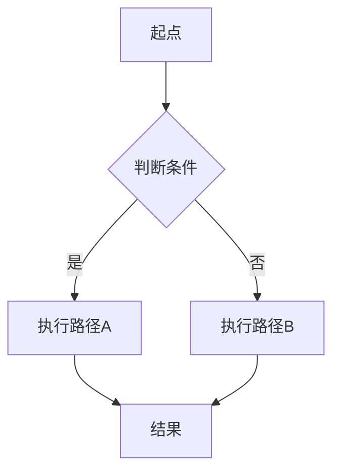
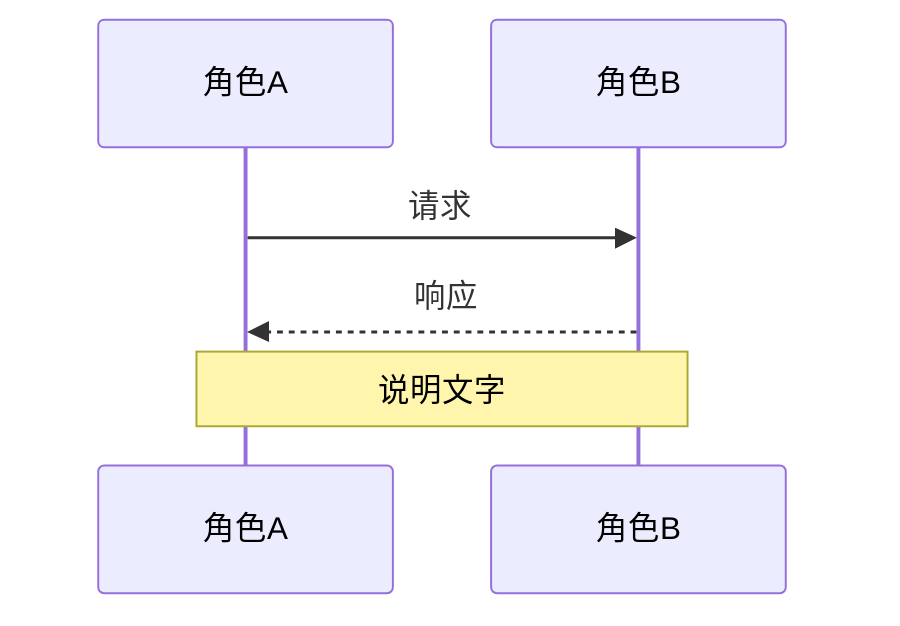
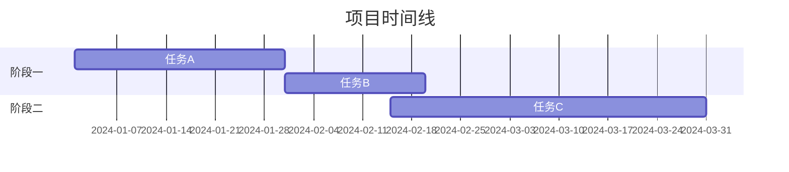
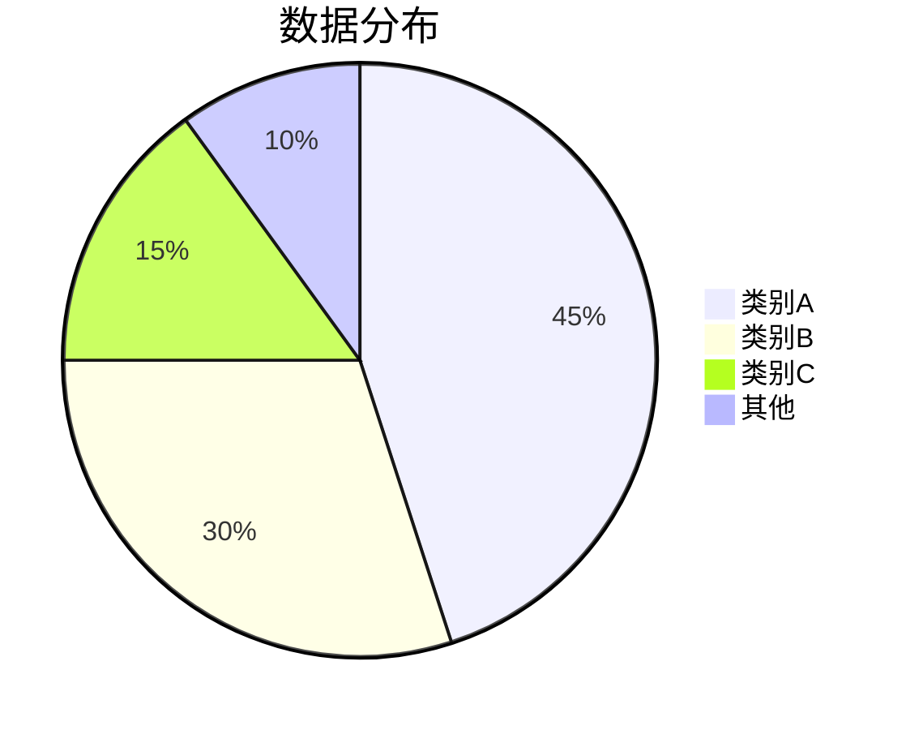
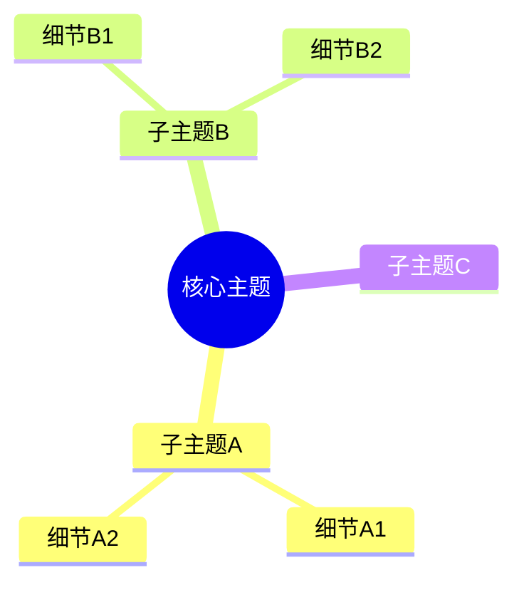
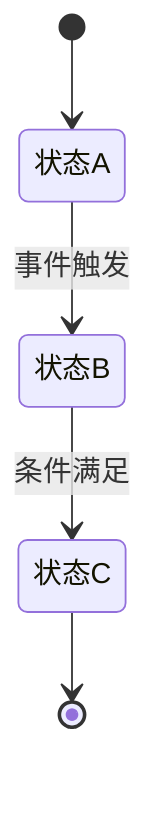
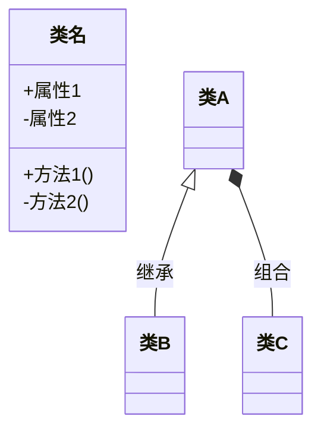

<!-- 作者：阿洋 -->

# Mermaid 图表模板库

以下为常用图表类型的 Mermaid.js 标准模板。所有模板均可直接粘贴到 Markdown 中的 ````mermaid` 代码块中。

## 1. 流程图 (Flowchart)



## 2. 时序图 (Sequence Diagram)



## 3. 甘特图 (Gantt Chart)



## 4. 饼图 (Pie Chart)



## 5. 思维导图 (Mindmap)



## 6. 状态图 (State Diagram)



## 7. 类图 (Class Diagram)



## 使用说明

1. 选择最接近目标结构的模板
2. 替换模板中的占位文字（起点、角色A、类别A 等）
3. 在 Mermaid 代码块中渲染：````mermaid {模板内容} ````
4. 若外部渲染工具不可用，HTML 穷尽尝试层已内嵌 Mermaid.js CDN 将自动渲染图表