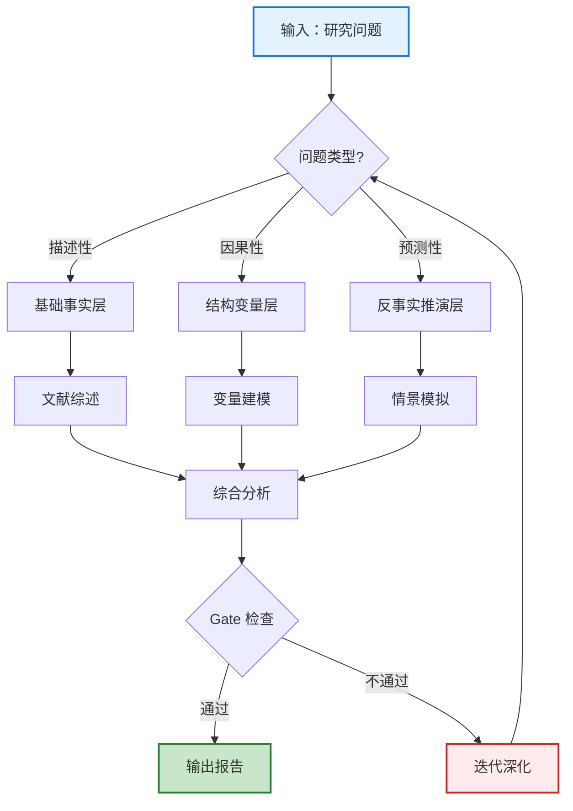
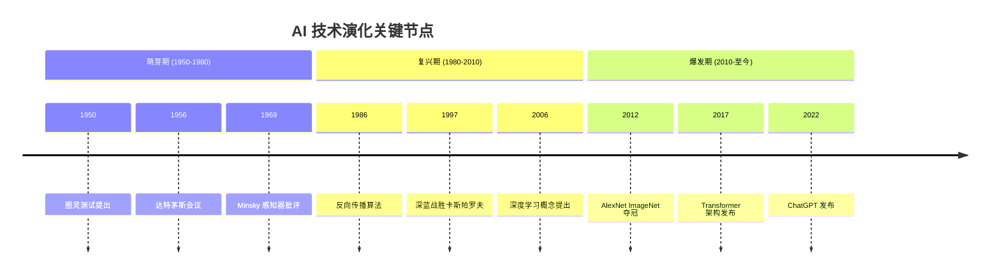
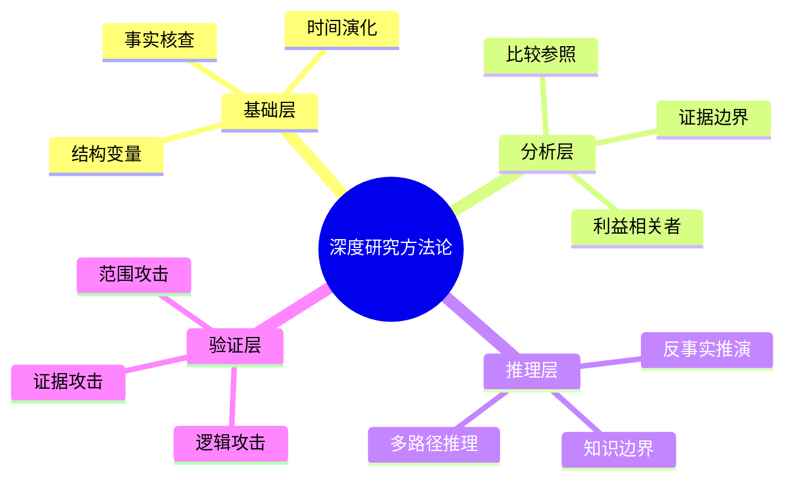
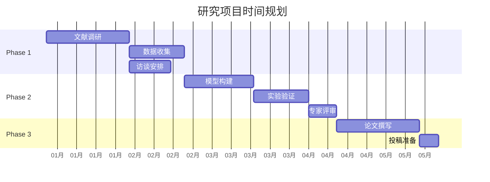
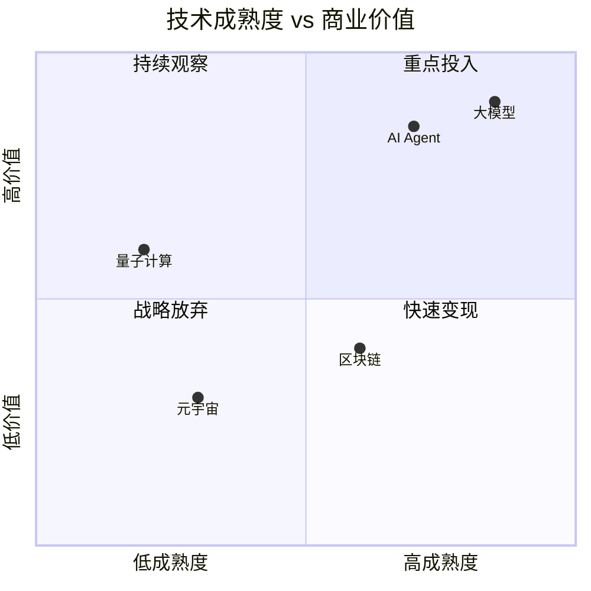
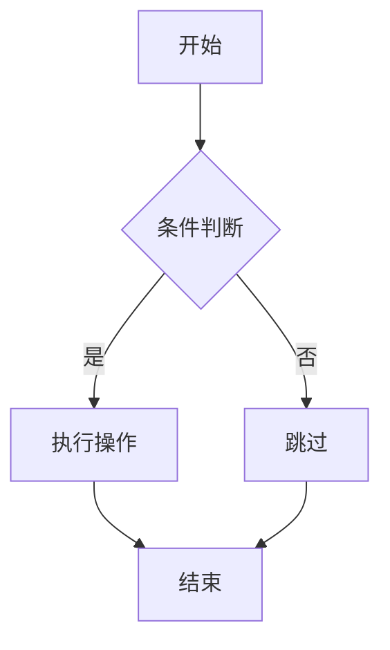

> **作者**: 阿洋

# 代码生成图规范（Code-First Illustration Generator）

> **模块标识**: `output/illustration-generator`
> **职责**: 通过**纯代码方式**（内联 SVG / Mermaid / CSS / Canvas / Matplotlib）为研究报告、公众号文章、课程材料生成匹配的配图。**严禁依赖任何 AI 生图 API**（Flux / Stable Diffusion / Qwen-Image / DALL-E / Midjourney 等一律禁用）。所有配图必须由 LLM 直接书写代码生成，确保零外部依赖、零 API 调用、零隐私泄露、零成本、可即时复现、可矢量缩放、可二次编辑。
> **依赖**: `output/aesthetic-enhancer`、`rendering-pipeline/visual-creative-atoms.md`、`rendering-pipeline/visual-dna.md`
> **CLI 命令**: 无（纯代码内联生成，平台原生渲染）
> **铁律**: 本模块生成的任何视觉元素必须严格遵循 `visual_dna` 中的配色/字体/间距/线条参数，不得使用硬编码值。

---

## §0 核心铁律（不可违反）

### 0.1 禁用清单（BLOCKING — 违反即拒）

```yaml
forbidden_apis:
  - "Flux.1 Dev / BFL API"
  - "Stable Diffusion / Stability AI API"
  - "Stable Diffusion WebUI（自部署）"
  - "ComfyUI（自部署）"
  - "Qwen-Image / DashScope 文生图"
  - "DALL-E 3 / OpenAI Images API"
  - "Midjourney / Imagine API"
  - "Nano Banana Pro / Gemini 3 Pro Image"
  - "任何 HTTP 形式的图像生成 API 调用"
  - "任何 base64 形式的 AI 生成图像嵌入"

forbidden_behaviors:
  - "以'API Key 未配置'为由省略配图"
  - "以'图像模型不可用'为由跳过配图"
  - "以'网络超时'为由推迟配图到补充阶段"
  - "在 Markdown 中嵌入远程 AI 生图 URL"
  - "在 HTML 中嵌入 AI 生成的 base64 图片"
  - "在 SVG 中嵌入 AI 生成的 <image href>"

required_behaviors:
  - "所有配图必须由 LLM 直接书写 SVG / Mermaid / CSS / Canvas 代码生成"
  - "所有配图必须可在目标平台（Claude Code / Cursor / Trae / Codex）原生渲染"
  - "所有配图必须遵循 visual_dna 配色/字体/线条规范"
  - "所有配图必须从 VCA 原子库（visual-creative-atoms.md）检索匹配风格"
  - "所有配图必须附图注（图号 + 标题 + 数据/来源标注）"
```

### 0.2 代码生成图优先级链（强制）

```
优先级 1（强制默认）: 内联 SVG（最高自由度，矢量可缩放，支持复杂艺术流派风格）
  ↓ 不适合复杂结构图时
优先级 2: Mermaid 代码块（结构图/流程图/时序图/甘特图/思维导图，平台原生渲染）
  ↓ 不适合数据图表时
优先级 3: Observable Plot / ECharts（数据驱动图表，CDN 加载）
  ↓ 不适合概念图时
优先级 4: Markmap（思维导图/概念图，层级展开）
  ↓ 不适合数学几何时
优先级 5: Canvas / Matplotlib（生成式艺术、数据科学图表）
  ↓ 极端兜底（仅当上述均无法表达时）
优先级 6: ASCII 艺术 + 文字描述占位（标注 [TEXT-ONLY]）
```

**铁律**：优先级 1-5 均为**代码生成**，不涉及任何 AI 生图 API。优先级 6 是纯文本兜底，仅用于极端情况（如目标平台完全不支持任何代码渲染）。

### 0.3 与 illustration-generation-protocol.md §6.4 的对齐

本模块严格遵循 `protocols/illustration-generation-protocol.md §6.4` 的"默认主方式（强制）"：

> 在目标平台（Claude Code / Cursor / Trae / Codex）上，**直接在成品文件中写出 Mermaid 代码块或内联 SVG**，作为默认且强制的图生成方式——这些平台原生渲染 Mermaid/SVG，无需任何外部服务或额外技能。research_report 的强制配图（见 SKILL.md §0.1 D：≥⌈字数/3000⌉ 张、六类齐全）一律以此方式落地。

---

## §1 内联 SVG 生成规范（优先级 1 — 强制默认）

### 1.1 SVG 生成核心原则

```yaml
svg_generation_principles:
  principle_1_vector_first: "所有 SVG 必须为纯矢量绘制，禁止嵌入位图 <image href>"
  principle_2_visual_dna_compliance: "配色/字体/线条必须从 visual_dna 读取，不得硬编码"
  principle_3_vca_atom_retrieval: "风格必须从 VCA 原子库（visual-creative-atoms.md）检索匹配原子"
  principle_4_anti_ai_slop: "必须遵循 VCA 反 AI 廉价感要点（肌理注入/配色锚定/构图破局/细节密度）"
  principle_5_accessibility: "必须包含 <title> 和 <desc> 子元素用于无障碍"
  principle_6_responsive: "必须使用 viewBox 属性，不得使用固定 width/height"
  principle_7_inline_styles: "样式必须内联（style 属性或 <style> 子元素），不依赖外部 CSS"
```

### 1.2 SVG 骨架模板（所有 SVG 必须遵循）

```svg
<svg xmlns="http://www.w3.org/2000/svg"
     viewBox="0 0 800 450"
     role="img"
     aria-labelledby="title desc">
  <title id="title">{图标题}</title>
  <desc id="desc">{图描述，用于无障碍读屏}</desc>

  <!-- 背景（从 visual_dna.color_scheme.background 读取） -->
  <rect width="800" height="450" fill="var(--color-background, #FAFAFA)"/>

  <!-- 主体内容（从 VCA 原子库检索风格） -->
  <!-- ... -->

  <!-- 图注（图号 + 标题 + 数据来源） -->
  <text x="400" y="430" text-anchor="middle"
        font-family="var(--font-body, sans-serif)"
        font-size="11" fill="var(--color-text-secondary, #757575)">
    图 {N}：{标题} — {数据/来源标注}
  </text>
</svg>
```

### 1.3 SVG 配色注入规则

所有 SVG 必须从 `visual_dna.color_scheme` 读取配色，通过 CSS 自定义属性注入：

```svg
<svg xmlns="http://www.w3.org/2000/svg" viewBox="0 0 800 450">
  <style>
    .vd-primary { fill: var(--color-primary, #2196F3); }
    .vd-secondary { fill: var(--color-secondary, #9C27B0); }
    .vd-accent { fill: var(--color-accent, #e94560); }
    .vd-text { fill: var(--color-text-primary, #212121); }
    .vd-text-muted { fill: var(--color-text-secondary, #757575); }
    .vd-bg { fill: var(--color-background, #FFFFFF); }
    .vd-surface { fill: var(--color-surface, #FAFAFA); }
    .vd-border { stroke: var(--color-border, #E0E0E0); }
  </style>
  <!-- 使用 class 引用，不硬编码颜色 -->
  <rect class="vd-bg" width="800" height="450"/>
  <circle class="vd-primary" cx="400" cy="225" r="80"/>
</svg>
```

### 1.4 SVG 图类型生成模板

#### 1.4.1 知识图谱（SVG 力导向布局）

```svg
<svg xmlns="http://www.w3.org/2000/svg" viewBox="0 0 800 500" role="img">
  <title>知识图谱：{主题}</title>
  <desc>展示{主题}的核心实体及其关系网络</desc>

  <!-- 背景 -->
  <rect width="800" height="500" fill="#FAFAFA"/>

  <!-- 关系连线（先画线，后画节点，确保节点覆盖线端） -->
  <g stroke="#BDBDBD" stroke-width="1.5" fill="none">
    <line x1="400" y1="250" x2="200" y2="150"/>
    <line x1="400" y1="250" x2="600" y2="150"/>
    <line x1="400" y1="250" x2="250" y2="400"/>
    <line x1="400" y1="250" x2="550" y2="400"/>
    <line x1="200" y1="150" x2="600" y2="150"/>
  </g>

  <!-- 关系标签 -->
  <g font-family="Inter, sans-serif" font-size="10" fill="#757575" text-anchor="middle">
    <text x="300" y="200">包含</text>
    <text x="500" y="200">影响</text>
    <text x="325" y="325">属于</text>
    <text x="475" y="325">驱动</text>
    <text x="400" y="140">关联</text>
  </g>

  <!-- 节点（核心概念） -->
  <g>
    <!-- 中心节点 -->
    <circle cx="400" cy="250" r="50" fill="#1976D2" stroke="#0D47A1" stroke-width="2"/>
    <text x="400" y="255" text-anchor="middle" font-family="Inter, sans-serif"
          font-size="14" font-weight="700" fill="#FFFFFF">核心概念</text>

    <!-- 周边节点 -->
    <circle cx="200" cy="150" r="35" fill="#BBDEFB" stroke="#1976D2" stroke-width="1.5"/>
    <text x="200" y="155" text-anchor="middle" font-family="Inter, sans-serif"
          font-size="11" fill="#212121">子概念A</text>

    <circle cx="600" cy="150" r="35" fill="#BBDEFB" stroke="#1976D2" stroke-width="1.5"/>
    <text x="600" y="155" text-anchor="middle" font-family="Inter, sans-serif"
          font-size="11" fill="#212121">子概念B</text>

    <circle cx="250" cy="400" r="35" fill="#FFCDD2" stroke="#E63946" stroke-width="1.5"/>
    <text x="250" y="405" text-anchor="middle" font-family="Inter, sans-serif"
          font-size="11" fill="#212121">实例C</text>

    <circle cx="550" cy="400" r="35" fill="#C8E6C9" stroke="#2E7D32" stroke-width="1.5"/>
    <text x="550" y="405" text-anchor="middle" font-family="Inter, sans-serif"
          font-size="11" fill="#212121">实例D</text>
  </g>

  <!-- 图注 -->
  <text x="400" y="480" text-anchor="middle" font-family="Inter, sans-serif"
        font-size="11" fill="#757575">图 1：{主题}知识图谱 — 节点表示核心实体，边表示关系类型</text>
</svg>
```

#### 1.4.2 时间线（SVG 横向时间轴）

```svg
<svg xmlns="http://www.w3.org/2000/svg" viewBox="0 0 900 300" role="img">
  <title>时间线：{事件演化}</title>
  <desc>展示{事件}从{起始年}到{终止年}的关键节点演化</desc>

  <rect width="900" height="300" fill="#FAFAFA"/>

  <!-- 主时间轴 -->
  <line x1="80" y1="150" x2="820" y2="150" stroke="#212121" stroke-width="2"/>

  <!-- 时间刻度 -->
  <g font-family="Inter, sans-serif" font-size="11" fill="#616161" text-anchor="middle">
    <line x1="150" y1="145" x2="150" y2="155" stroke="#212121" stroke-width="1.5"/>
    <text x="150" y="175">2019</text>

    <line x1="350" y1="145" x2="350" y2="155" stroke="#212121" stroke-width="1.5"/>
    <text x="350" y="175">2021</text>

    <line x1="550" y1="145" x2="550" y2="155" stroke="#212121" stroke-width="1.5"/>
    <text x="550" y="175">2023</text>

    <line x1="750" y1="145" x2="750" y2="155" stroke="#212121" stroke-width="1.5"/>
    <text x="750" y="175">2025</text>
  </g>

  <!-- 事件节点（上下交错布局） -->
  <g>
    <!-- 上方事件 -->
    <circle cx="150" cy="150" r="8" fill="#1976D2"/>
    <line x1="150" y1="142" x2="150" y2="100" stroke="#1976D2" stroke-width="1"/>
    <text x="150" y="90" text-anchor="middle" font-family="Inter, sans-serif"
          font-size="11" font-weight="600" fill="#212121">事件A</text>
    <text x="150" y="78" text-anchor="middle" font-family="Inter, sans-serif"
          font-size="9" fill="#757575">关键描述</text>

    <!-- 下方事件 -->
    <circle cx="350" cy="150" r="8" fill="#E63946"/>
    <line x1="350" y1="158" x2="350" y2="200" stroke="#E63946" stroke-width="1"/>
    <text x="350" y="215" text-anchor="middle" font-family="Inter, sans-serif"
          font-size="11" font-weight="600" fill="#212121">事件B</text>
    <text x="350" y="227" text-anchor="middle" font-family="Inter, sans-serif"
          font-size="9" fill="#757575">关键描述</text>

    <!-- 上方事件 -->
    <circle cx="550" cy="150" r="8" fill="#2E7D32"/>
    <line x1="550" y1="142" x2="550" y2="100" stroke="#2E7D32" stroke-width="1"/>
    <text x="550" y="90" text-anchor="middle" font-family="Inter, sans-serif"
          font-size="11" font-weight="600" fill="#212121">事件C</text>
    <text x="550" y="78" text-anchor="middle" font-family="Inter, sans-serif"
          font-size="9" fill="#757575">关键描述</text>

    <!-- 下方事件 -->
    <circle cx="750" cy="150" r="8" fill="#FF9800"/>
    <line x1="750" y1="158" x2="750" y2="200" stroke="#FF9800" stroke-width="1"/>
    <text x="750" y="215" text-anchor="middle" font-family="Inter, sans-serif"
          font-size="11" font-weight="600" fill="#212121">事件D</text>
    <text x="750" y="227" text-anchor="middle" font-family="Inter, sans-serif"
          font-size="9" fill="#757575">关键描述</text>
  </g>

  <!-- 图注 -->
  <text x="450" y="285" text-anchor="middle" font-family="Inter, sans-serif"
        font-size="11" fill="#757575">图 2：{事件}演化时间线 — 节点为关键里程碑，颜色编码事件类型</text>
</svg>
```

#### 1.4.3 对比信息图（SVG 双栏对比）

```svg
<svg xmlns="http://www.w3.org/2000/svg" viewBox="0 0 800 500" role="img">
  <title>对比信息图：{A vs B}</title>
  <desc>对比{方案A}与{方案B}在多维度上的差异</desc>

  <rect width="800" height="500" fill="#FAFAFA"/>

  <!-- 标题 -->
  <text x="400" y="40" text-anchor="middle" font-family="Inter, sans-serif"
        font-size="18" font-weight="700" fill="#212121">{A} vs {B}</text>

  <!-- 左栏（方案A） -->
  <g>
    <rect x="50" y="70" width="320" height="380" fill="#E3F2FD" rx="8"/>
    <text x="210" y="100" text-anchor="middle" font-family="Inter, sans-serif"
          font-size="14" font-weight="700" fill="#0D47A1">方案 A</text>

    <g font-family="Inter, sans-serif" font-size="11" fill="#212121">
      <text x="70" y="135">优势：</text>
      <text x="80" y="155" fill="#2E7D32">✓ 优势点 1</text>
      <text x="80" y="175" fill="#2E7D32">✓ 优势点 2</text>
      <text x="80" y="195" fill="#2E7D32">✓ 优势点 3</text>

      <text x="70" y="230">劣势：</text>
      <text x="80" y="250" fill="#C62828">✗ 劣势点 1</text>
      <text x="80" y="270" fill="#C62828">✗ 劣势点 2</text>

      <text x="70" y="305">关键指标：</text>
      <text x="80" y="325">性能：★★★★☆</text>
      <text x="80" y="345">成本：★★★☆☆</text>
      <text x="80" y="365">复杂度：★★☆☆☆</text>
    </g>
  </g>

  <!-- 右栏（方案B） -->
  <g>
    <rect x="430" y="70" width="320" height="380" fill="#FFEBEE" rx="8"/>
    <text x="590" y="100" text-anchor="middle" font-family="Inter, sans-serif"
          font-size="14" font-weight="700" fill="#B71C1C">方案 B</text>

    <g font-family="Inter, sans-serif" font-size="11" fill="#212121">
      <text x="450" y="135">优势：</text>
      <text x="460" y="155" fill="#2E7D32">✓ 优势点 1</text>
      <text x="460" y="175" fill="#2E7D32">✓ 优势点 2</text>
      <text x="460" y="195" fill="#2E7D32">✓ 优势点 3</text>

      <text x="450" y="230">劣势：</text>
      <text x="460" y="250" fill="#C62828">✗ 劣势点 1</text>
      <text x="460" y="270" fill="#C62828">✗ 劣势点 2</text>

      <text x="450" y="305">关键指标：</text>
      <text x="460" y="325">性能：★★★☆☆</text>
      <text x="460" y="345">成本：★★★★★</text>
      <text x="460" y="365">复杂度：★★★★☆</text>
    </g>
  </g>

  <!-- 图注 -->
  <text x="400" y="485" text-anchor="middle" font-family="Inter, sans-serif"
        font-size="11" fill="#757575">图 3：{A}与{B}多维度对比 — 涵盖优势/劣势/关键指标</text>
</svg>
```

#### 1.4.4 系统因果结构图（SVG 反馈回路）

```svg
<svg xmlns="http://www.w3.org/2000/svg" viewBox="0 0 800 500" role="img">
  <title>系统因果结构图：{系统名}</title>
  <desc>展示{系统}的正反馈与负反馈回路结构</desc>

  <rect width="800" height="500" fill="#FAFAFA"/>

  <!-- 反馈回路连线（带箭头） -->
  <defs>
    <marker id="arrow-positive" viewBox="0 0 10 10" refX="9" refY="5"
            markerWidth="6" markerHeight="6" orient="auto-start-reverse">
      <path d="M 0 0 L 10 5 L 0 10 z" fill="#2E7D32"/>
    </marker>
    <marker id="arrow-negative" viewBox="0 0 10 10" refX="9" refY="5"
            markerWidth="6" markerHeight="6" orient="auto-start-reverse">
      <path d="M 0 0 L 10 5 L 0 10 z" fill="#C62828"/>
    </marker>
  </defs>

  <!-- 正反馈回路（绿色 + 号） -->
  <g stroke="#2E7D32" stroke-width="2" fill="none" marker-end="url(#arrow-positive)">
    <path d="M 200 150 Q 300 100 400 150"/>
    <path d="M 400 200 Q 500 250 600 200"/>
    <path d="M 600 250 Q 700 300 600 350"/>
    <path d="M 550 350 Q 400 400 250 350"/>
    <path d="M 200 300 Q 150 250 200 200"/>
  </g>

  <!-- 负反馈回路（红色 - 号） -->
  <g stroke="#C62828" stroke-width="2" fill="none" marker-end="url(#arrow-negative)"
     stroke-dasharray="6,3">
    <path d="M 400 150 Q 500 100 600 150"/>
  </g>

  <!-- 节点 -->
  <g font-family="Inter, sans-serif" font-size="11" text-anchor="middle">
    <rect x="160" y="135" width="80" height="30" fill="#FFFFFF" stroke="#1976D2" rx="4"/>
    <text x="200" y="155" fill="#212121">变量 A</text>

    <rect x="360" y="135" width="80" height="30" fill="#FFFFFF" stroke="#1976D2" rx="4"/>
    <text x="400" y="155" fill="#212121">变量 B</text>

    <rect x="560" y="135" width="80" height="30" fill="#FFFFFF" stroke="#1976D2" rx="4"/>
    <text x="600" y="155" fill="#212121">变量 C</text>

    <rect x="560" y="335" width="80" height="30" fill="#FFFFFF" stroke="#1976D2" rx="4"/>
    <text x="600" y="355" fill="#212121">变量 D</text>

    <rect x="360" y="335" width="80" height="30" fill="#FFFFFF" stroke="#1976D2" rx="4"/>
    <text x="400" y="355" fill="#212121">变量 E</text>

    <rect x="160" y="335" width="80" height="30" fill="#FFFFFF" stroke="#1976D2" rx="4"/>
    <text x="200" y="355" fill="#212121">变量 F</text>
  </g>

  <!-- 极性标注 -->
  <g font-family="Inter, sans-serif" font-size="14" font-weight="700">
    <text x="300" y="115" fill="#2E7D32">+</text>
    <text x="500" y="115" fill="#C62828">−</text>
    <text x="650" y="270" fill="#2E7D32">+</text>
    <text x="450" y="395" fill="#2E7D32">+</text>
    <text x="250" y="395" fill="#2E7D32">+</text>
    <text x="130" y="270" fill="#2E7D32">+</text>
  </g>

  <!-- 回路标识 -->
  <g font-family="Inter, sans-serif" font-size="12" font-weight="700">
    <text x="400" y="450" text-anchor="middle" fill="#2E7D32">↻ 正反馈回路（增强型）</text>
    <text x="500" y="100" text-anchor="middle" fill="#C62828">↺ 负反馈回路（平衡型）</text>
  </g>

  <!-- 图注 -->
  <text x="400" y="485" text-anchor="middle" font-family="Inter, sans-serif"
        font-size="11" fill="#757575">图 4：{系统}因果回路图 — 绿色为正反馈（+），红色虚线为负反馈（−）</text>
</svg>
```

#### 1.4.5 决策路径图（SVG 决策树）

```svg
<svg xmlns="http://www.w3.org/2000/svg" viewBox="0 0 900 500" role="img">
  <title>决策路径图：{决策场景}</title>
  <desc>展示{决策场景}的多分支决策路径与预期结果</desc>

  <rect width="900" height="500" fill="#FAFAFA"/>

  <defs>
    <marker id="decision-arrow" viewBox="0 0 10 10" refX="9" refY="5"
            markerWidth="6" markerHeight="6" orient="auto-start-reverse">
      <path d="M 0 0 L 10 5 L 0 10 z" fill="#616161"/>
    </marker>
  </defs>

  <!-- 连线 -->
  <g stroke="#616161" stroke-width="1.5" fill="none" marker-end="url(#decision-arrow)">
    <line x1="450" y1="80" x2="250" y2="180"/>
    <line x1="450" y1="80" x2="650" y2="180"/>
    <line x1="250" y1="220" x2="150" y2="320"/>
    <line x1="250" y1="220" x2="350" y2="320"/>
    <line x1="650" y1="220" x2="550" y2="320"/>
    <line x1="650" y1="220" x2="750" y2="320"/>
  </g>

  <!-- 决策节点（菱形） -->
  <g>
    <polygon points="450,40 530,80 450,120 370,80" fill="#FFF3E0" stroke="#FF9800" stroke-width="2"/>
    <text x="450" y="85" text-anchor="middle" font-family="Inter, sans-serif"
          font-size="12" font-weight="700" fill="#212121">核心决策</text>
  </g>

  <!-- 分支条件节点（矩形） -->
  <g font-family="Inter, sans-serif" font-size="11" text-anchor="middle">
    <rect x="200" y="180" width="100" height="40" fill="#E3F2FD" stroke="#1976D2" rx="4"/>
    <text x="250" y="205" fill="#212121">条件 A</text>

    <rect x="600" y="180" width="100" height="40" fill="#E3F2FD" stroke="#1976D2" rx="4"/>
    <text x="650" y="205" fill="#212121">条件 B</text>
  </g>

  <!-- 分支标签 -->
  <g font-family="Inter, sans-serif" font-size="10" fill="#757575">
    <text x="340" y="135">是</text>
    <text x="560" y="135">否</text>
    <text x="190" y="275">是</text>
    <text x="320" y="275">否</text>
    <text x="590" y="275">是</text>
    <text x="720" y="275">否</text>
  </g>

  <!-- 结果节点（圆角矩形） -->
  <g font-family="Inter, sans-serif" font-size="11" text-anchor="middle">
    <rect x="100" y="320" width="100" height="40" fill="#C8E6C9" stroke="#2E7D32" rx="4"/>
    <text x="150" y="345" fill="#1B5E20">结果 1（最优）</text>

    <rect x="300" y="320" width="100" height="40" fill="#FFF9C4" stroke="#FBC02D" rx="4"/>
    <text x="350" y="345" fill="#F57F17">结果 2（次优）</text>

    <rect x="500" y="320" width="100" height="40" fill="#FFF9C4" stroke="#FBC02D" rx="4"/>
    <text x="550" y="345" fill="#F57F17">结果 3（次优）</text>

    <rect x="700" y="320" width="100" height="40" fill="#FFCDD2" stroke="#C62828" rx="4"/>
    <text x="750" y="345" fill="#B71C1C">结果 4（最差）</text>
  </g>

  <!-- 图注 -->
  <text x="450" y="485" text-anchor="middle" font-family="Inter, sans-serif"
        font-size="11" fill="#757575">图 5：{决策场景}决策路径 — 菱形为决策点，矩形为条件，圆角矩形为结果</text>
</svg>
```

#### 1.4.6 数据图表（SVG 柱状图）

```svg
<svg xmlns="http://www.w3.org/2000/svg" viewBox="0 0 800 450" role="img">
  <title>数据图表：{指标名}对比</title>
  <desc>展示{N}个类别在{指标}上的数值对比</desc>

  <rect width="800" height="450" fill="#FAFAFA"/>

  <!-- 坐标轴 -->
  <g stroke="#212121" stroke-width="1.5" fill="none">
    <line x1="80" y1="50" x2="80" y2="380"/>
    <line x1="80" y1="380" x2="750" y2="380"/>
  </g>

  <!-- Y 轴刻度 -->
  <g font-family="Inter, sans-serif" font-size="10" fill="#616161" text-anchor="end">
    <line x1="75" y1="380" x2="80" y2="380" stroke="#212121"/>
    <text x="70" y="384">0</text>
    <line x1="75" y1="298" x2="80" y2="298" stroke="#212121"/>
    <text x="70" y="302">25</text>
    <line x1="75" y1="215" x2="80" y2="215" stroke="#212121"/>
    <text x="70" y="219">50</text>
    <line x1="75" y1="133" x2="80" y2="133" stroke="#212121"/>
    <text x="70" y="137">75</text>
    <line x1="75" y1="50" x2="80" y2="50" stroke="#212121"/>
    <text x="70" y="54">100</text>
  </g>

  <!-- 网格线 -->
  <g stroke="#E0E0E0" stroke-width="0.5" stroke-dasharray="3,3">
    <line x1="80" y1="298" x2="750" y2="298"/>
    <line x1="80" y1="215" x2="750" y2="215"/>
    <line x1="80" y1="133" x2="750" y2="133"/>
    <line x1="80" y1="50" x2="750" y2="50"/>
  </g>

  <!-- 柱子 -->
  <g>
    <rect x="130" y="133" width="80" height="247" fill="#1976D2"/>
    <text x="170" y="125" text-anchor="middle" font-family="Inter, sans-serif"
          font-size="11" font-weight="600" fill="#212121">75</text>

    <rect x="270" y="83" width="80" height="297" fill="#2196F3"/>
    <text x="310" y="75" text-anchor="middle" font-family="Inter, sans-serif"
          font-size="11" font-weight="600" fill="#212121">90</text>

    <rect x="410" y="182" width="80" height="198" fill="#64B5F6"/>
    <text x="450" y="174" text-anchor="middle" font-family="Inter, sans-serif"
          font-size="11" font-weight="600" fill="#212121">60</text>

    <rect x="550" y="240" width="80" height="140" fill="#BBDEFB"/>
    <text x="590" y="232" text-anchor="middle" font-family="Inter, sans-serif"
          font-size="11" font-weight="600" fill="#212121">42</text>

    <rect x="690" y="156" width="50" height="224" fill="#90CAF9"/>
    <text x="715" y="148" text-anchor="middle" font-family="Inter, sans-serif"
          font-size="11" font-weight="600" fill="#212121">68</text>
  </g>

  <!-- X 轴标签 -->
  <g font-family="Inter, sans-serif" font-size="11" fill="#212121" text-anchor="middle">
    <text x="170" y="400">类别 A</text>
    <text x="310" y="400">类别 B</text>
    <text x="450" y="400">类别 C</text>
    <text x="590" y="400">类别 D</text>
    <text x="715" y="400">类别 E</text>
  </g>

  <!-- 轴标题 -->
  <text x="415" y="430" text-anchor="middle" font-family="Inter, sans-serif"
        font-size="12" font-weight="600" fill="#212121">类别</text>
  <text x="30" y="215" text-anchor="middle" font-family="Inter, sans-serif"
        font-size="12" font-weight="600" fill="#212121"
        transform="rotate(-90 30 215)">数值</text>

  <!-- 图注 -->
  <text x="415" y="445" text-anchor="middle" font-family="Inter, sans-serif"
        font-size="11" fill="#757575">图 6：{指标}多类别对比 — 数据来源：{来源标注}</text>
</svg>
```

---

## §2 Mermaid 代码块生成规范（优先级 2 — 结构图首选）

### 2.1 Mermaid 适用场景

```yaml
mermaid_scenarios:
  - "流程图（flowchart）— 展示步骤、决策、分支"
  - "时序图（sequenceDiagram）— 展示交互时序"
  - "状态图（stateDiagram-v2）— 展示状态转换"
  - "甘特图（gantt）— 展示项目时间线"
  - "思维导图（mindmap）— 展示概念层级"
  - "类图（classDiagram）— 展示对象关系"
  - "ER 图（erDiagram）— 展示实体关系"
  - "C4 图（C4Context/C4Container）— 展示系统架构"
  - "用户旅程图（journey）— 展示用户体验"
  - "Git 图（gitGraph）— 展示版本演进"
  - "象限图（quadrantChart）— 展示二维分类"
  - "需求图（requirementDiagram）— 展示需求关系"
  - "时间线（timeline）— 展示事件演化"
```

### 2.2 Mermaid 主题配置（visual_dna 注入）

```yaml
mermaid_theme_config:
  # 从 visual_dna 读取配色，注入 Mermaid 主题
  theme_variables:
    primaryColor: "${visual_dna.color_scheme.primary}"
    primaryTextColor: "${visual_dna.color_scheme.text}"
    primaryBorderColor: "${visual_dna.color_scheme.primary_dark}"
    lineColor: "${visual_dna.color_scheme.border}"
    secondaryColor: "${visual_dna.color_scheme.secondary}"
    tertiaryColor: "${visual_dna.color_scheme.surface}"
    background: "${visual_dna.color_scheme.background}"
    fontFamily: "${visual_dna.font_scheme.body}"
```

### 2.3 Mermaid 模板示例

#### 2.3.1 流程图



#### 2.3.2 时间线



#### 2.3.3 思维导图



#### 2.3.4 甘特图



#### 2.3.5 象限图



---

## §3 VCA 原子库对接规范

### 3.1 VCA 检索流程

```yaml
vca_retrieval_flow:
  step_1:
    action: "识别配图内容类型"
    input: "配图请求（含主题/场景/受众）"
    output: "内容类型标识（技术封面/数据可视/品牌视觉/生成式艺术）"

  step_2:
    action: "从 VCA 原子库检索匹配原子"
    input: "内容类型标识"
    output: "VCA 原子（含 SVG 模板 + 配色方案 + 风格规范）"
    rule: "见 §3.2 内容类型 → VCA 原子映射表"

  step_3:
    action: "加载 VCA 原子的 SVG 生成模板"
    input: "VCA 原子"
    output: "SVG 代码骨架（含配色占位符）"

  step_4:
    action: "从 visual_dna 注入配色/字体/线条参数"
    input: "SVG 代码骨架 + visual_dna"
    output: "完整可渲染的 SVG 代码"

  step_5:
    action: "应用反 AI 廉价感要点"
    input: "SVG 代码 + VCA 原子的反 AI 廉价感规则"
    output: "最终 SVG 代码（含肌理注入/配色锚定/构图破局/细节密度）"
```

### 3.2 内容类型 → VCA 原子映射表

```yaml
content_type_to_vca_mapping:
  - content_type: "科技产品封面图"
    vca_atoms:
      primary: "VCA-ART-003 瑞士风格"
      secondary: "VCA-ART-001 极简主义"
    style_characteristics: "网格驱动、信息层级清晰、无衬线字体"
    retrieval_rule: "科技产品封面优先检索 VCA-ART-003，备选 VCA-ART-001"

  - content_type: "数据可视配图"
    vca_atoms:
      primary: "VCA-DATA-001 经济学人风格"
      secondary: "VCA-DATA-006 Distill 风格"
    style_characteristics: "克制配色、直接标注、高数据墨水比"
    retrieval_rule: "数据可视配图优先检索 VCA-DATA-001，备选 VCA-DATA-006"

  - content_type: "品牌视觉元素"
    vca_atoms:
      primary: "VCA-BRAND-001 Logo 占位"
      secondary: "VCA-BRAND-003 品牌纹理"
    style_characteristics: "品牌色驱动、一致性优先"
    retrieval_rule: "品牌视觉元素优先检索 VCA-BRAND-001，备选 VCA-BRAND-003"

  - content_type: "生成式艺术背景"
    vca_atoms:
      primary: "VCA-GEN-001 流场"
      secondary: "VCA-GEN-004 Perlin 噪声"
    style_characteristics: "算法生成、有机纹理、低饱和"
    retrieval_rule: "生成式艺术背景优先检索 VCA-GEN-001，备选 VCA-GEN-004"

  - content_type: "革命性/激进主题"
    vca_atoms:
      primary: "VCA-ART-002 构成主义"
    style_characteristics: "红黑配色、对角线构图、几何块状"
    retrieval_rule: "革命性主题优先检索 VCA-ART-002"

  - content_type: "创意/复古/玩乐主题"
    vca_atoms:
      primary: "VCA-ART-004 孟菲斯"
    style_characteristics: "鲜艳撞色、几何混搭、打破网格"
    retrieval_rule: "创意复古主题优先检索 VCA-ART-004"
```

### 3.3 VCA 原子调用示例

```python
# 伪代码：VCA 原子检索与 SVG 生成
def generate_illustration_via_vca(content_type: str, visual_dna: dict) -> str:
    """
    通过 VCA 原子库生成 SVG 配图
    """
    # Step 1: 检索匹配的 VCA 原子
    vca_atom = retrieve_vca_atom(content_type)

    # Step 2: 加载 SVG 模板
    svg_template = vca_atom.svg_template

    # Step 3: 注入 visual_dna 配色
    svg_filled = inject_visual_dna(svg_template, visual_dna)

    # Step 4: 应用反 AI 廉价感要点
    svg_final = apply_anti_ai_slop(svg_filled, vca_atom.anti_ai_slop_rules)

    return svg_final
```

---

## §4 配图类型 → 生成方式路由表

```yaml
illustration_type_routing:
  # 结构性图表 → Mermaid 优先
  - type: "流程图"
    primary: "Mermaid flowchart"
    secondary: "SVG 手绘"
    forbidden: ["AI 生图 API"]

  - type: "时序图"
    primary: "Mermaid sequenceDiagram"
    secondary: "SVG 手绘"
    forbidden: ["AI 生图 API"]

  - type: "状态图"
    primary: "Mermaid stateDiagram-v2"
    secondary: "SVG 手绘"
    forbidden: ["AI 生图 API"]

  - type: "甘特图"
    primary: "Mermaid gantt"
    secondary: "SVG 手绘"
    forbidden: ["AI 生图 API"]

  - type: "思维导图"
    primary: "Mermaid mindmap"
    secondary: "Markmap"
    forbidden: ["AI 生图 API"]

  - type: "类图/ER 图"
    primary: "Mermaid classDiagram/erDiagram"
    secondary: "SVG 手绘"
    forbidden: ["AI 生图 API"]

  # 数据驱动图表 → Observable Plot / ECharts / SVG
  - type: "柱状图"
    primary: "SVG 手绘（简单）或 Observable Plot（复杂）"
    secondary: "ECharts"
    forbidden: ["AI 生图 API"]

  - type: "折线图"
    primary: "SVG 手绘（简单）或 Observable Plot（复杂）"
    secondary: "ECharts"
    forbidden: ["AI 生图 API"]

  - type: "散点图"
    primary: "Observable Plot"
    secondary: "SVG 手绘"
    forbidden: ["AI 生图 API"]

  - type: "热力图"
    primary: "ECharts"
    secondary: "SVG 手绘"
    forbidden: ["AI 生图 API"]

  # 概念性图表 → SVG 优先
  - type: "知识图谱"
    primary: "SVG 力导向布局"
    secondary: "Mermaid graph"
    forbidden: ["AI 生图 API"]

  - type: "时间线"
    primary: "SVG 横向时间轴"
    secondary: "Mermaid timeline"
    forbidden: ["AI 生图 API"]

  - type: "对比信息图"
    primary: "SVG 双栏对比"
    secondary: "Mermaid quadrantChart"
    forbidden: ["AI 生图 API"]

  - type: "系统因果结构图"
    primary: "SVG 反馈回路"
    secondary: "Mermaid flowchart"
    forbidden: ["AI 生图 API"]

  - type: "决策路径图"
    primary: "SVG 决策树"
    secondary: "Mermaid flowchart"
    forbidden: ["AI 生图 API"]

  # 艺术性配图 → VCA 原子库 SVG
  - type: "封面图"
    primary: "VCA 原子库 SVG（瑞士风格/极简主义/构成主义等）"
    secondary: "SVG 自定义"
    forbidden: ["AI 生图 API"]

  - type: "章节头图"
    primary: "VCA 原子库 SVG"
    secondary: "SVG 自定义"
    forbidden: ["AI 生图 API"]

  - type: "概念插图"
    primary: "VCA 原子库 SVG（艺术流派风格）"
    secondary: "SVG 自定义"
    forbidden: ["AI 生图 API", "Qwen-Image", "Flux", "Stable Diffusion"]

  - type: "装饰性背景"
    primary: "VCA-GEN 生成式艺术 SVG（流场/Perlin 噪声等）"
    secondary: "CSS 渐变"
    forbidden: ["AI 生图 API"]
```

---

## §5 图片格式与嵌入方式

### 5.1 输出格式选择

| 格式 | 适用场景 | 特点 | 生成方式 |
|------|----------|------|---------|
| **内联 SVG** | 所有矢量配图（首选） | 矢量、无限缩放、可编辑、零外部依赖 | LLM 直接书写 SVG 代码 |
| **Mermaid 代码块** | 结构性图表 | 平台原生渲染、可版本控制 | LLM 直接书写 Mermaid 代码 |
| **HTML Canvas** | 复杂动画/交互 | 像素级控制、60fps 动画 | LLM 直接书写 Canvas JS 代码 |
| **CSS 渲染** | 简单装饰/渐变 | 零依赖、响应式 | LLM 直接书写 CSS 代码 |
| **ASCII 艺术** | 极端兜底 | 纯文本、终端可读 | LLM 直接书写 ASCII 字符 |

**禁用格式**：
- ❌ PNG/JPEG/WebP（除非由 SVG/Mermaid 经平台渲染导出）
- ❌ Base64 内联图片（除非为 SVG 的 base64 编码）
- ❌ 远程图片 URL（除 CDN 加载的 JS 库如 ECharts/Observable Plot）

### 5.2 嵌入方式

#### 5.2.1 Markdown 文档嵌入（Mermaid）

````markdown


*图 1：流程示意图 — 展示条件判断与分支执行逻辑*
````

#### 5.2.2 Markdown 文档嵌入（SVG）

````markdown
<svg xmlns="http://www.w3.org/2000/svg" viewBox="0 0 800 450" role="img">
  <title>示例图</title>
  <desc>展示示例内容</desc>
  <!-- SVG 内容 -->
</svg>

*图 2：示例图 — 数据来源：xxx*
````

#### 5.2.3 HTML 文档嵌入

```html
<figure>
  <svg xmlns="http://www.w3.org/2000/svg" viewBox="0 0 800 450" role="img">
    <title>配图标题</title>
    <desc>配图描述</desc>
    <!-- SVG 内容 -->
  </svg>
  <figcaption>图 1：配图标题 — 数据来源标注</figcaption>
</figure>
```

#### 5.2.4 Typst 文档嵌入

```typst
#figure(
  image("illustration.svg", width: 80%),
  caption: [图 1：配图标题 — 数据来源标注]
)
```

---

## §6 质量检查清单

### 6.1 生成前检查

- [ ] 配图类型已从 §4 路由表选择正确的生成方式
- [ ] VCA 原子已从 §3.2 映射表检索匹配
- [ ] visual_dna 配色/字体/线条参数已读取
- [ ] SVG 骨架模板已加载（含 `<title>` 和 `<desc>` 无障碍元素）
- [ ] 反 AI 廉价感要点已应用（肌理注入/配色锚定/构图破局/细节密度）
- [ ] **未使用任何 AI 生图 API**（Flux/SD/Qwen-Image/DALL-E/Midjourney 均禁用）

### 6.2 生成后检查

- [ ] SVG 使用 viewBox 属性，响应式可缩放
- [ ] SVG 配色从 visual_dna 读取，未硬编码
- [ ] SVG 包含 `<title>` 和 `<desc>` 无障碍元素
- [ ] Mermaid 代码块语法正确，可在平台原生渲染
- [ ] 图注完整（图号 + 标题 + 数据/来源标注）
- [ ] 配图与正文内容语义匹配（≤3 个段落距离内）
- [ ] 配图风格与文档整体视觉语言一致

### 6.3 风格一致性检查

- [ ] 同一文档内所有配图风格统一（同一 VCA 原子或同一 DLP 族）
- [ ] 色调与文档主题色板一致（visual_dna.color_scheme）
- [ ] 字体与文档字体方案一致（visual_dna.font_scheme）
- [ ] 线条质感与文档线条规范一致（visual_dna.line_style）
- [ ] 宽高比合理，无拉伸变形

### 6.4 反 AI 廉价感检查（来自 VCA 原子库）

- [ ] **肌理注入**：几何边缘有微抖动或纹理叠加，对抗过度平滑
- [ ] **配色锚定**：配色锚定真实艺术流派，非 AI 凭空生成的"安全配色"
- [ ] **构图破局**：禁止居中对称模板化构图，采用艺术流派标志性构图
- [ ] **细节密度**：保持艺术流派标志性细节密度，对抗 AI 的"平均化"细节

---

## §7 穷尽尝试输出规范（极端兜底）

### 7.1 触发条件

仅当以下极端情况同时发生时，才触发穷尽尝试兜底：

1. 目标平台完全不支持 SVG 渲染
2. 目标平台完全不支持 Mermaid 渲染
3. 目标平台完全不支持 HTML/Canvas/CSS 渲染
4. 目标平台仅支持纯文本

### 7.2 兜底输出模板

#### 7.2.1 ASCII 艺术占位（推荐首选兜底）

```
┌─────────────────────────────────────────────────────────┐
│                                                         │
│   [图N：{图标题}]                                       │
│                                                         │
│   类型：{图类型}                                        │
│   描述：{图描述}                                        │
│   数据来源：{来源标注}                                  │
│                                                         │
│   ⚠ 当前平台不支持 SVG/Mermaid 渲染，                   │
│      已穷尽尝试所有代码生成图方式，                     │
│      使用 ASCII 艺术兜底。                              │
│                                                         │
└─────────────────────────────────────────────────────────┘
```

#### 7.2.2 文字描述占位（最终兜底）

```markdown
> 📊 **配图占位**：`[图N：{图标题}]`
>
> - **类型**：{图类型}
> - **描述**：{图描述}
> - **数据来源**：{来源标注}
> - **推荐生成方式**：SVG / Mermaid（目标平台恢复渲染后补齐）
>
> ⚠ 当前平台完全不支持代码生成图渲染，使用文字描述兜底。
> 此配图需在支持 SVG/Mermaid 的环境中重新渲染。
```

### 7.3 兜底质量要求

- 占位图保留完整的图号、标题、描述、数据来源信息
- 提供可复用的 SVG/Mermaid 代码骨架（供平台恢复后补齐）
- 明确标注"兜底状态"与"推荐生成方式"
- 占位图不影响文档排版和阅读流畅性
- **绝不以兜底为由省略配图**——配图数量与类型覆盖必须达标

---

## §8 与渲染管道的集成声明

> **声明**: 本模块（illustration-generator）为渲染管道（`rendering-pipeline/`）的原子化能力组件，挂载于 html-ppt-skill 容器底座之上。
> **调用入口**: 渲染管道启动时，通过 `rendering-pipeline/ARCHITECTURE.md` 路由到本模块。
> **依赖关系**:
> - 上游: `rendering-pipeline/visual-dna.md`（读取配色方案、字体方案、线条质感）
> - 上游: `rendering-pipeline/semantic-auto-detect.md`（接收配图类型标注）
> - 上游: `rendering-pipeline/layout-grid.md`（遵循栅格系统、页面尺寸、边距规范）
> - 上游: `rendering-pipeline/motion-semantic-match.md`（如需要动效，遵循语义匹配规则）
> - 上游: `rendering-pipeline/visual-creative-atoms.md`（VCA 原子库，检索艺术流派风格）
> - 同级: `output/aesthetic-enhancer.md`（美学增强协同）
> - 同级: `output/chart-renderer.md`（数据图表协同，Observable Plot/ECharts）
> - 同级: `output/mindmap-renderer.md`（思维导图协同，Markmap）
> - 同级: `plugins/paper-figure-adapter.md`（手绘风格 SVG 框架图协同）
> **强制规则**:
> 1. 本模块生成的任何视觉元素必须严格遵循 `visual_dna` 中的配色/字体/间距/线条参数，不得使用硬编码值。
> 2. 本模块**严禁调用任何 AI 生图 API**，所有配图必须由 LLM 直接书写代码（SVG/Mermaid/Canvas/CSS）生成。
> 3. 本模块必须从 VCA 原子库（`visual-creative-atoms.md`）检索匹配风格，确保视觉风格有据可依、可复用、可追溯。
> 4. 本模块必须遵循 `protocols/illustration-generation-protocol.md §6.4` 的"默认主方式（强制）"。

---

## §9 与其他模块的协同关系

### 9.1 与 chart-renderer.md 的分工

| 图表类型 | 本模块（illustration-generator） | chart-renderer.md |
|---------|--------------------------------|-------------------|
| 简单柱状图（≤5 类别） | SVG 手绘优先 | 备选 |
| 复杂数据图表（>5 类别） | 路由至 chart-renderer | Observable Plot/ECharts |
| 流程图/时序图/状态图 | Mermaid 优先 | 不处理 |
| 知识图谱/概念图 | SVG 优先 | 不处理 |
| 时间线/对比信息图 | SVG 优先 | 不处理 |
| 系统因果结构图/决策路径图 | SVG 优先 | 不处理 |
| 艺术性配图（封面/章节头图） | VCA 原子库 SVG 优先 | 不处理 |

### 9.2 与 mindmap-renderer.md 的分工

| 图表类型 | 本模块 | mindmap-renderer.md |
|---------|--------|---------------------|
| 简单思维导图（≤3 层） | Mermaid mindmap 优先 | 备选 |
| 复杂思维导图（>3 层） | 路由至 mindmap-renderer | Markmap |
| 概念图/知识图谱 | SVG 优先 | 不处理 |

### 9.3 与 paper-figure-adapter.md 的分工

| 图表类型 | 本模块 | paper-figure-adapter.md |
|---------|--------|-------------------------|
| 标准框架图 | SVG 优先 | 备选（手绘风格） |
| 手绘风格框架图 | 路由至 paper-figure-adapter | 手绘 SVG |
| 知识图谱/方法论图 | SVG 优先 | 备选（手绘风格） |

---

## §10 版本历史

| 版本 | 日期 | 变更 |
|------|------|------|
| v1.0 | 2025-初版 | 基于 AI 生图 API（Flux/SD）的初版 |
| v2.0 | 2026-06-21 | **彻底重构为代码生成图规范**，移除所有 AI 生图 API 依赖，改为 SVG/Mermaid/Canvas/CSS 代码生成，对接 VCA 原子库，对齐 illustration-generation-protocol.md §6.4 |

---

© 阿洋
